# Logistics Sales

## 1. Vào module nghiệp vụ

1. Góc trái màn hình, click chọn ở logo tên công ty để vào danh sách module.
2. Click chọn module Logistics Sales.

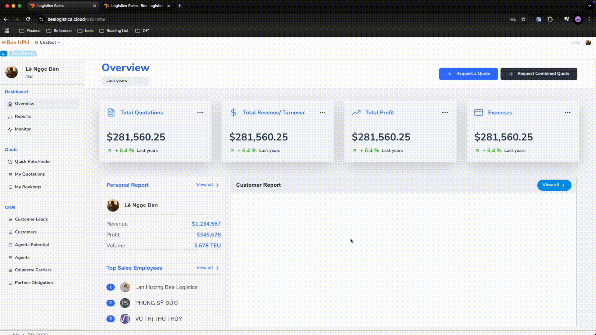

<!-- 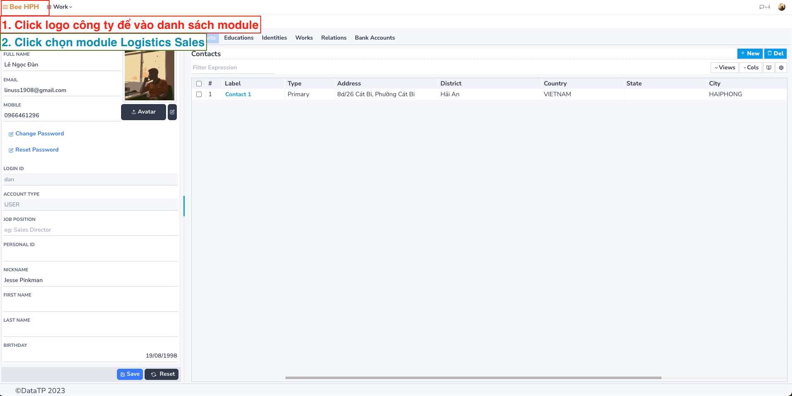 -->

3. Phần mềm vào màn hình mặc định Dashboard - Overview

## 2. Tạo yêu cầu báo giá - Match giá
Tìm kiếm giá có sẵn từ hệ thống Pricing Tools (Logistics Prices).

Trên màn hình Dashboard, click chọn "Request a Quote" để chuyển qua màn hình yêu cầu giá.

Nhập các thông tin cần thiết:
   - Transportation Mode (Loại hình vận chuyển)
   - Origin of Shipment (cảng load)
   - Destination of Shipment (cảng dỡ)
   - Ready to Load (ngày hàng có thể vận chuyển) - phần mềm dựa vào ngày này để tìm giá valid

Click **Match Price** để tìm giá.

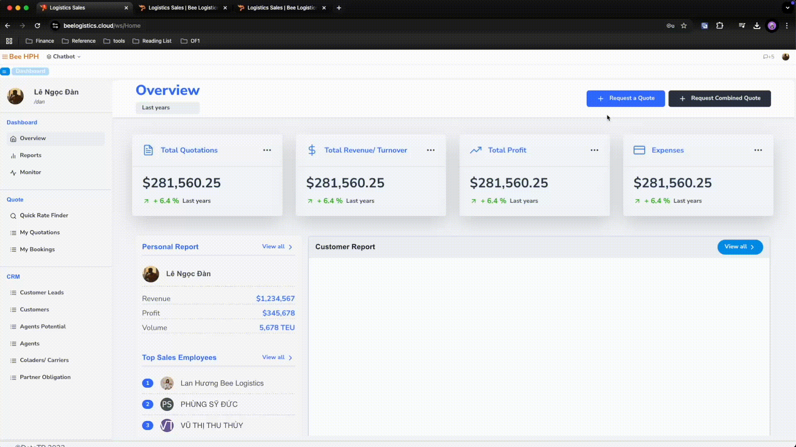

### 2.1. Trường hợp có giá sẵn từ hệ thống Pricing
Phần mềm hiển thị kết quả gồm bảng thông tin giá cước và phụ phí tương ứng.

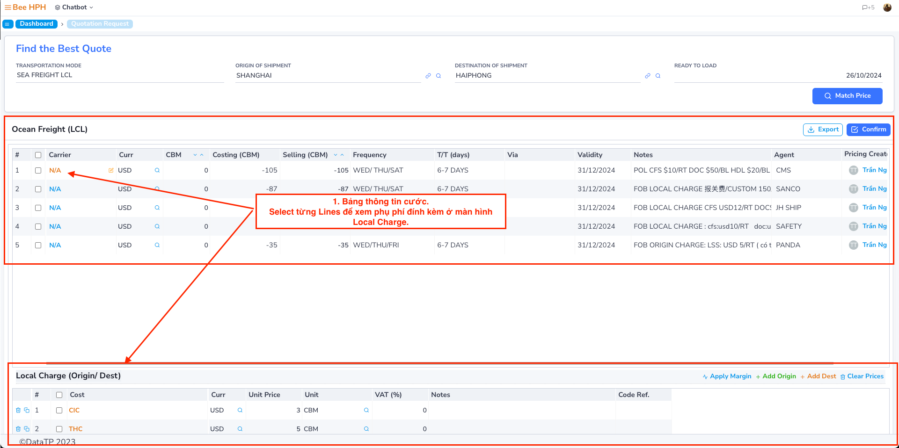

 

User tích chọn giá từ các Lines/ Agent -> Chọn _`Confirm`_ để chuyển qua màn hình Quotation.

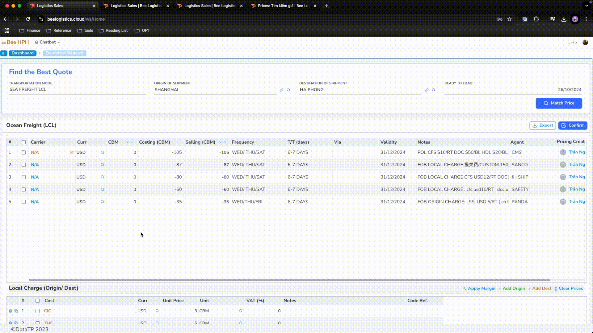

 

Hoặc chỉnh giá trực tiếp và export báo giá nhanh:

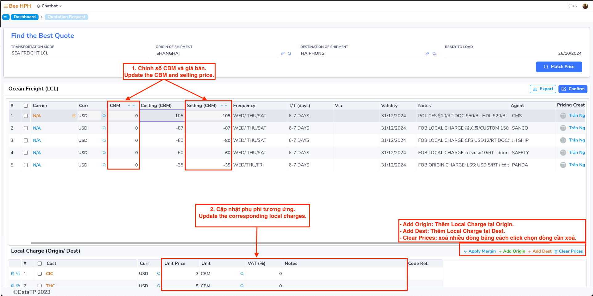
- Add Origin/ Dest: Thêm phụ phí tại Origin/ Destination.
- Clear Prices: Xoá phụ phí (bằng cách tick chọn).
- Apply Margin: Áp dụng tỷ lệ margin với giá gốc (percent/ amount).

Click _`Export`_ để xuất báo giá excel hoặc _`Confirm`_ để chuyển qua màn hình quotation.

### 2.2. Trường hợp không có giá sẵn trong hệ thống

1. Phần mềm hiển thị như màn hình dưới:

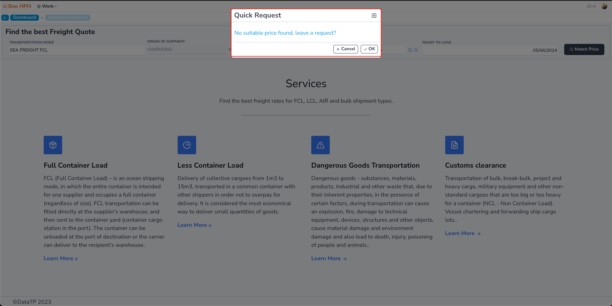

2. Click chọn OK để tạo draft quotation, phần mềm hiển thị form thông tin liên quan đến lô hàng.

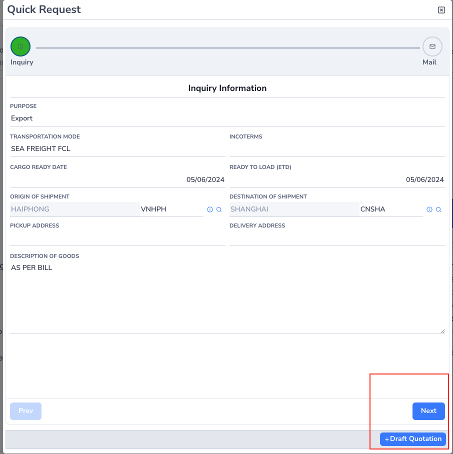

3. Sau khi nhập các thông tin cần thiết:
   - Click **Next** để chuyển qua màn hình thông tin mail request đến pricing phụ trách.
   - Hoặc Click **Draft Quotation** để tạo bản nháp báo giá

## 3. Màn hình quotation.

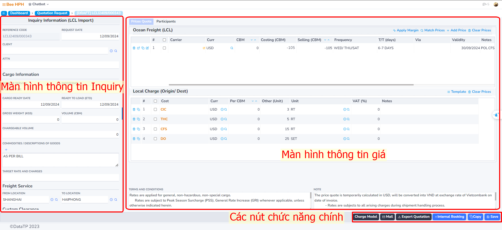

#### 3.1. Thông tin Inquiry

- Request Date: ngày khách gửi yêu cầu
- Client: thông tin khách hàng
- Attn: người đại diện (cho khách hàng)
- Term Of Service:
  - Trừ Port To Port, các services khác khi thay đổi pm sẽ hiển thị thêm màn hình bảng giá dịch vụ trucking.
- Custom Clearance:
  - Tick chọn ***Port At Origin/ Port At Destination***, phần mềm sẽ hiển thị thêm màn hình giá cho dịch vụ khai quan.

#### 3.2. Container Packing

Thay đổi loại container, click save, phần mềm sẽ hiển thị thêm các tuỳ chọn mức giá tương ứng ở bảng giá phía dưới.

#### 3.3. Ocean Freight/ Local Charge

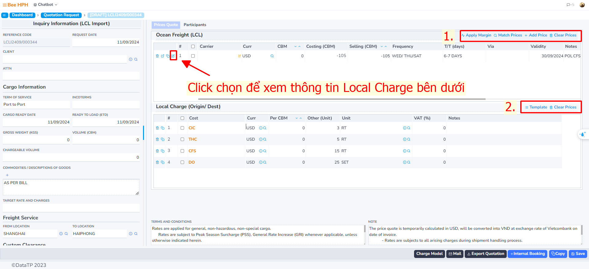

- Màu vàng (giá đang chọn) - đánh dấu để phân biệt cho màn hình local charge ở dưới. (Mỗi bảng giá sẽ có các local charge riêng biệt)
- Thay đổi tuỳ chọn bằng cách click vào biểu tượng
- Các nút chức năng bên cạnh lần lượt là ***copy, xem chi tiết, xoá*** theo thứ tự.

##### Chức năng khác (1):

- **Apply Margin**: Cập nhật lại báo giá được chọn
- **Match Price**: Tìm lại giá có sẵn từ hệ thống pricing
- **Add Price**: Thêm giá thủ công (tạo thêm dòng mới trên bảng)
- **Clear Prices**: Xoá tất cả trên bảng

##### Chức năng khác (2):

- **Template**: Tạo nhanh Origin/Destination Local Charge từ danh sách có sẵn

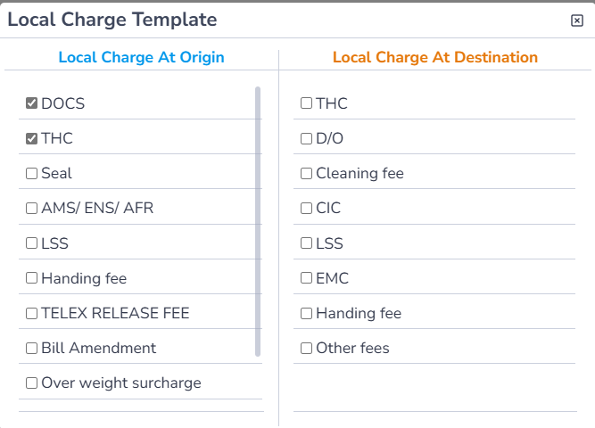

- **Clear Prices**: Xoá tất cả local charges trên bảng

#### 2.3.4. Chỉnh sửa và lưu báo giá

- Người dùng có thể thay đổi trực tiếp giá bán ở trên bảng.
- Charge Model: Chỉnh sửa thông tin báo giá
- Sau khi chỉnh sửa xong bảng giá, click **Save** để tiến hành lưu báo giá.

#### 2.3.5. Các chức năng khác

- ***Export Quotation***: Xuất thông tin báo giá
- ***Mail***: Gửi mail đến pricing phụ trách yêu cầu hỏi thêm giá hoặc gửi mail cho khách hàng báo giá
- ***Copy***: Tạo bản sao quotation
- ***Internal Booking***: Tạo Booking trong hệ thống (cập nhật cho giai đoạn sau)

#### 2.3.6. Tab Participants

Liên quan đến thông tin/ phân quyền cho người tham gia để handle báo giá này, cho các quy trình tạo báo giá, nhập thông tin và các quy trình tiếp theo như tạo booking, bill, …

## 3. Lưu ý

- Cách thao tác tương tự cho báo giá hàng Air, LCL.
- Phần khác nhau chủ yếu liên quan đến thông tin thu thập, form báo giá, trường nhập, … Còn về chức năng, thiết kế màn hình khá tương tự nhau.

***Tài liệu này sẽ liên tục được cập nhật để bổ sung các phần thay đổi hoặc thông tin còn thiếu.***