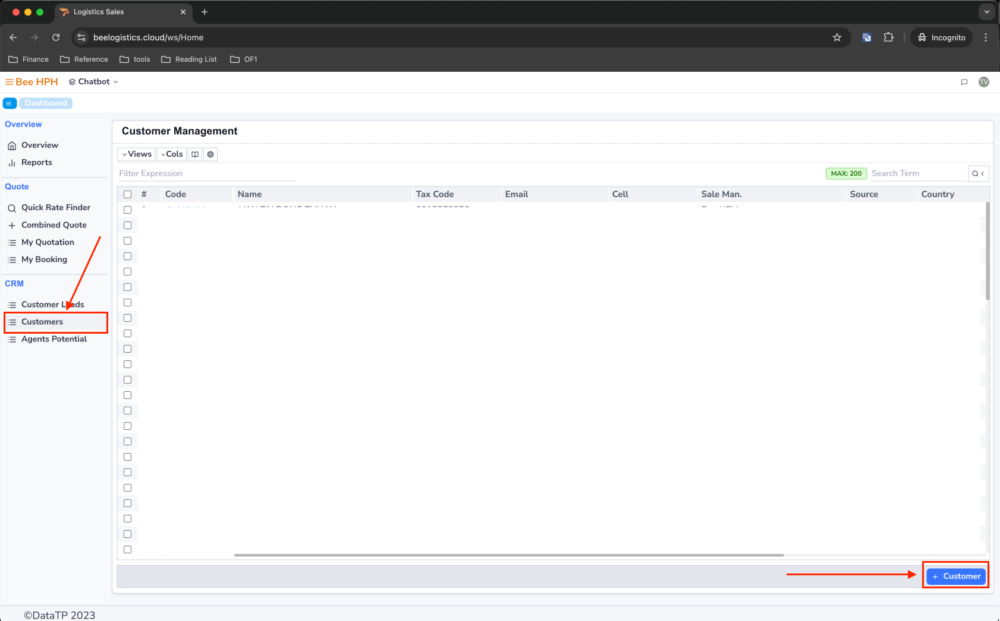

# Logistics Sales

## 1. Vào module nghiệp vụ

a. Góc trái màn hình, click chọn ở logo tên công ty để vào danh sách module.
b. Click chọn module Logistics Sales.

<!--  -->

c. Phần mềm vào màn hình mặc định Dashboard - Overview

## 2. Tìm giá, tạo/ xuất báo giá, tạo Internal Booking.

### 2.1. Kiểm tra thông tin khách hàng

Trước khi bắt đầu tạo báo giá, anh chị cần kiểm tra thông tin khách hàng được phân quyền ở phần __Customers__:

Lưu ý: Thông tin khách hàng được đồng bộ tự động từ hệ thống BFSOne. Nếu có bất kỳ sai sót hoặc cần cập nhật, vui lòng liên hệ IT để được hỗ trợ.

### 2.2. Chính sách quản lý báo giá (Policy)

- Mỗi báo giá chỉ có một owner duy nhất
- Owner có toàn quyền xem và quản lý báo giá của mình
- Các users khác không thể xem/chỉnh sửa báo giá không thuộc quyền quản lý
- Việc phân quyền này nhằm đảm bảo tính bảo mật thông tin

### 2.3. Hướng dẫn chi tiết theo loại hình

Tùy theo loại hình vận chuyển, vui lòng tham khảo hướng dẫn chi tiết:

- **Vận chuyển FCL (Full Container Load)**: [Xem hướng dẫn chi tiết tại đây](/docs/crm/fcl_process)
  - Quy trình tìm giá
  - Tạo và xuất báo giá
  - Tạo Internal Booking

- **Vận chuyển LCL (Less Container Load)**: [Xem hướng dẫn chi tiết tại đây](/docs/crm/lcl_process)
  - Quy trình tìm giá
  - Tạo và xuất báo giá
  - Tạo Internal Booking

## 3. Yêu cầu tạo khách hàng mới

Hãy nhấp vào **Menu Customers** trong **Sidebar**.

Trên màn hình **danh sách Customers**, dưới thanh công cụ, nhấp vào **New Customer** để yêu cầu tạo **khách hàng mới**.

Phần mềm sẽ hiển thị một **biểu mẫu thông tin** cần nhập. Vui lòng điền đầy đủ thông tin và nhấp vào **Create** để gửi **yêu cầu**.

