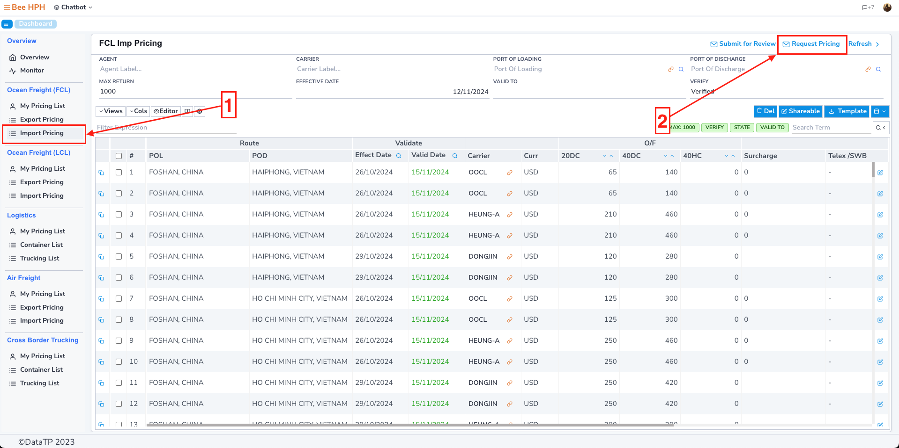
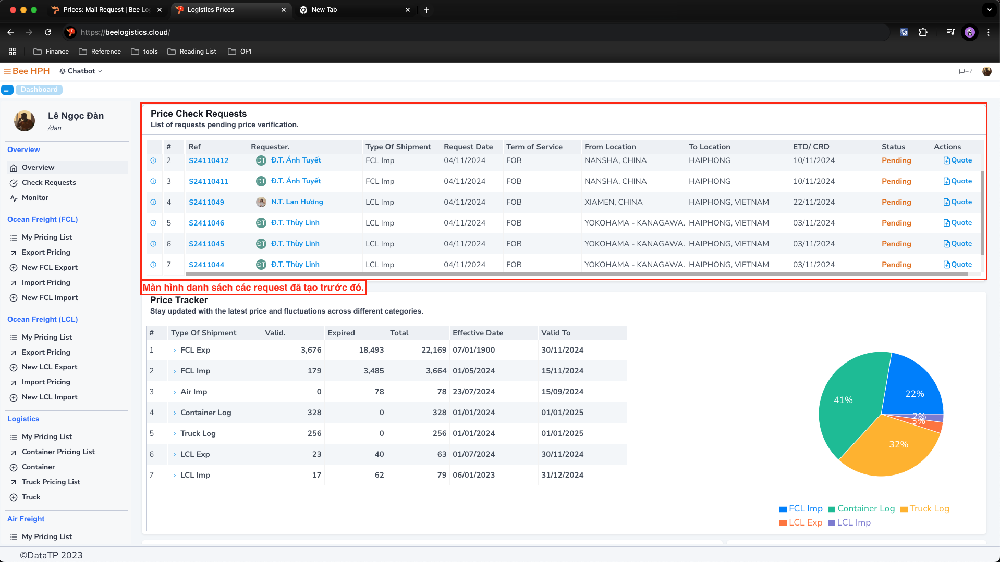
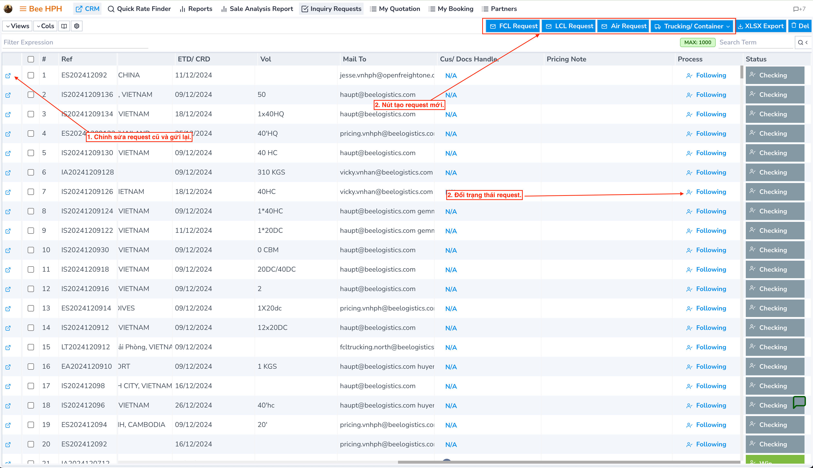
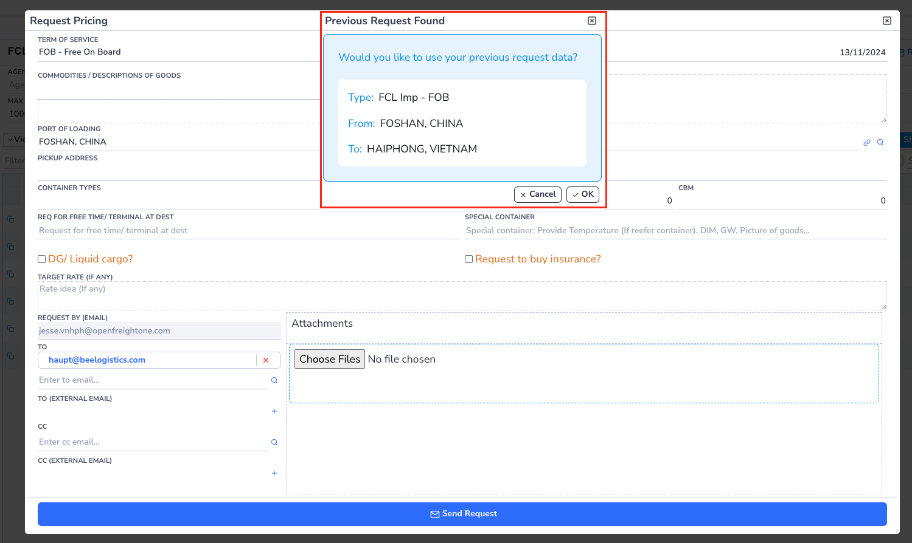

# Mail Request

Hướng dẫn chi tiết về cách sử dụng các tính năng liên quan đến tích hợp **email/outlook** trên **Logistics Prices**.

## Tính năng Mail Request Pricing (Check giá)

Khi không tìm thấy giá phù hợp cho một tuyến vận chuyển cụ thể, bạn có thể sử dụng tính năng **Request Pricing** để gửi yêu cầu hỏi giá qua email.

### Quy trình thực hiện

1. Trên màn hình search giá, thực hiện tìm kiếm cho tuyến đường cần báo giá
2. Nếu không có kết quả phù hợp, nhấn nút `Request Pricing` trên thanh công cụ để mở form yêu cầu

### Form yêu cầu báo giá

#### 1. Thông tin người gửi/nhận
- **From (Email)**: Email người gửi yêu cầu
- **TO**: Email chính của team Pricing _(tự động điền theo tuyến)_
- **TO (External Email)**: Email người nhận bổ sung (ngoài hệ thống)
- **CC**: Email CC trong hệ thống
- **CC (External Email)**: Email CC bổ sung (ngoài hệ thống)

#### 2. File đính kèm
- **Attachments**: Tải lên file đính kèm (tối đa 35MB)
  - Kéo thả file trực tiếp vào form
  - Hoặc chọn file từ máy tính

> **Lưu ý**: Sau khi điền đầy đủ thông tin, nhấn `Request` để gửi yêu cầu

### Demo thao tác

## Quản lý yêu cầu đã gửi

### Xem lại yêu cầu
Tại màn hình **Overview**, bạn có thể xem lại danh sách các yêu cầu đã gửi trước đó:

### Gửi lại yêu cầu
Để tránh phải nhập lại thông tin khi gửi yêu cầu tương tự:
1. Click vào cột **Ref** của yêu cầu cần gửi lại
2. Form sẽ tự động điền các thông tin từ yêu cầu cũ
3. Cập nhật thông tin cần thiết và gửi yêu cầu mới

### Tính năng tự động điền thông tin
- Khi tạo yêu cầu mới, hệ thống sẽ tự động kiểm tra yêu cầu tương tự đã gửi trước đó
- Nếu tìm thấy, hệ thống sẽ hiển thị popup thông báo
- Nhấn `OK` để tự động điền thông tin từ yêu cầu cũ vào form mới
- Giúp tiết kiệm thời gian và đảm bảo tính nhất quán của thông tin

