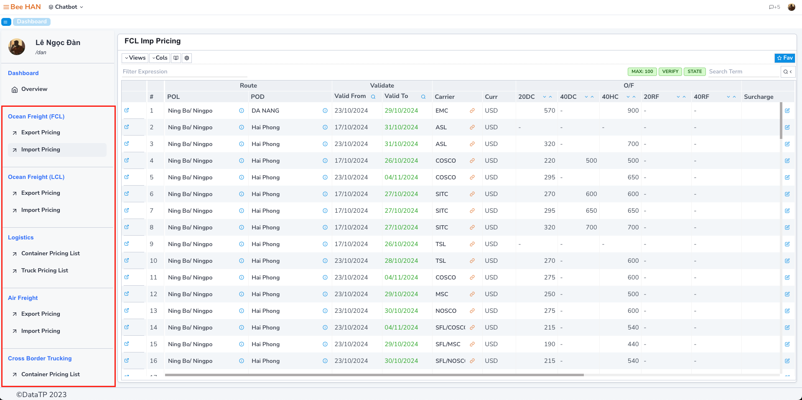
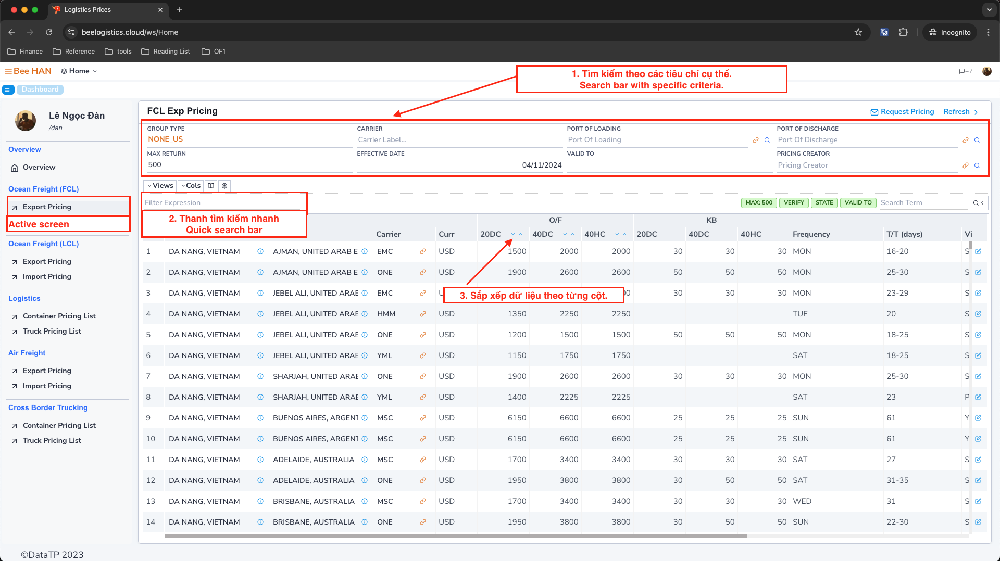
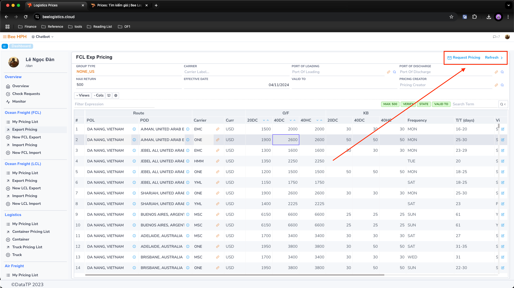

# Tìm kiếm giá

Dưới đây là hướng dẫn chi tiết về cách sử dụng các tính năng tìm kiếm:

## Giao diện tổng quan

Khi truy cập vào Dashboard của module, bạn sẽ thấy:

- Bên trái: Sidebar hiển thị danh sách các loại hình giá.
- Bên phải: Màn hình chính hiển thị danh sách giá tương ứng với loại hình được chọn.

Ví dụ, khi chọn "Import Pricing", màn hình sẽ hiển thị như sau:

Mặc định, hệ thống sẽ hiển thị các giá đang có hiệu lực (ngày hết hạn lớn hơn ngày hiện tại).

## Phương pháp tìm kiếm

Có hai cách chính để tìm kiếm giá:

### 1. Tìm kiếm nâng cao

- **Carrier, Agent:** Tìm theo hãng tàu hoặc đại lý

- **Pricing Creator:** Tìm theo người tạo giá

- **From Location, To Location:** Tìm theo cảng đi và cảng đến

- **Valid To:** Tìm kiếm giá theo thời hạn hiệu lực. Hệ thống sẽ hiển thị các bảng giá có thời hạn hiệu lực từ ngày bạn nhập trở đi.

- **Verify:**
    - Waiting: Bảng giá chưa được approve
    - Verified: Bảng giá đã được approve.

- **Max Return:** Giới hạn số lượng kết quả hiển thị. Để tối ưu hiệu suất tìm kiếm và tải dữ liệu, bạn nên:
  - Chỉ nhập số lượng kết quả thực sự cần thiết
  - Kết hợp với các bộ lọc khác để thu hẹp phạm vi tìm kiếm
  - Lọc dần kết quả từ tổng quan đến chi tiết

Để mở rộng khả năng tìm kiếm, bạn có thể nhấp vào biểu tượng kính lúp ở góc phải màn hình để truy cập thêm các tiêu chí tìm kiếm nâng cao

### 2. Tìm kiếm nhanh

Để thực hiện tìm kiếm nhanh, bạn có thể sử dụng thanh tìm kiếm được đặt ở góc trên cùng của màn hình.

Chỉ cần nhập từ khóa cần tìm, hệ thống sẽ tự động lọc và hiển thị các kết quả phù hợp.

Lưu ý quan trọng:

Tính năng tìm kiếm nhanh chỉ thực hiện tìm kiếm trên dữ liệu đang được hiển thị trên màn hình hiện tại,
không thực hiện tìm kiếm trong toàn bộ cơ sở dữ liệu. Điều này giúp tăng tốc độ tìm kiếm và cho kết quả ngay lập tức.

Lưu ý: Phương pháp tìm kiếm này áp dụng tương tự cho các màn hình khác trong module Prices.

### 3. Các tính năng bổ sung

- **Làm mới dữ liệu**: Sử dụng nút Refresh để cập nhật và đồng bộ lại thông tin giá mới nhất từ hệ thống.

- **Yêu cầu check giá**: Thông qua nút Request Pricing, bạn có thể gửi yêu cầu kiểm tra giá qua email trực tiếp đến Pricing Team.

Chi tiết về cách sử dụng, vui lòng tham khảo [hướng dẫn tại đây](/docs/crm/prices_mail_request).
