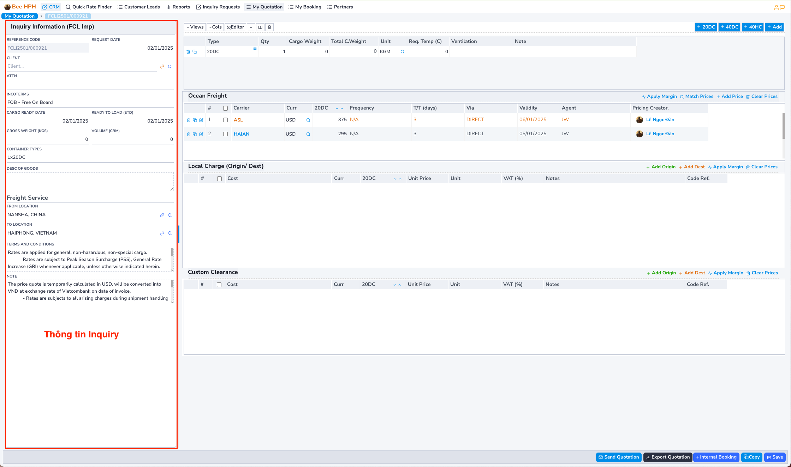
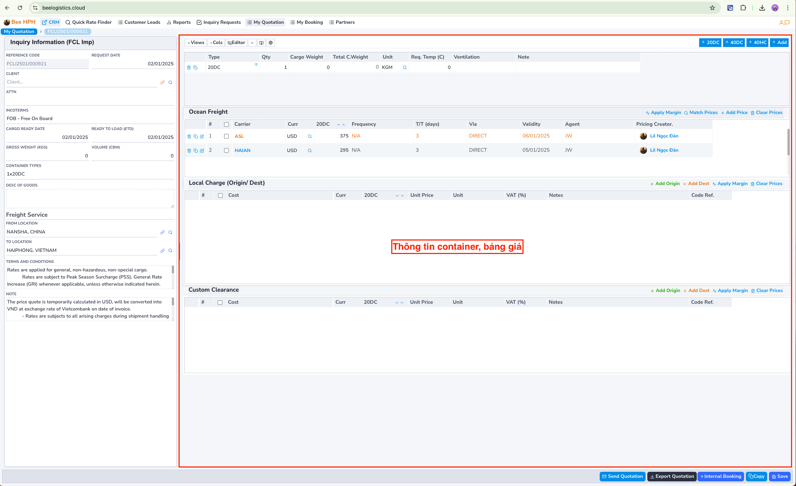
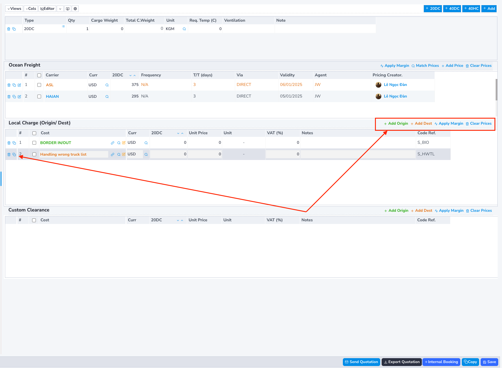
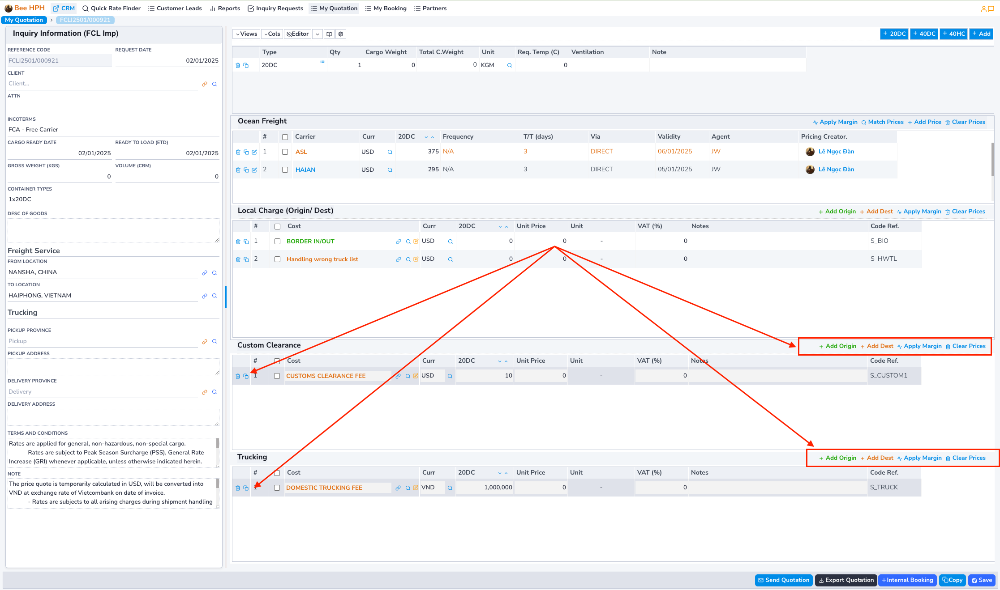
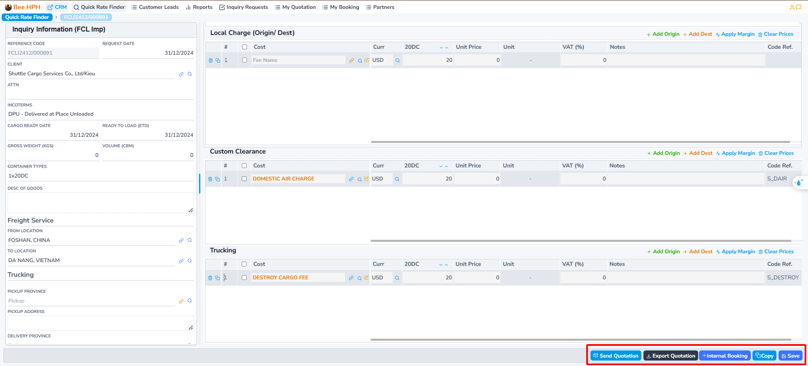
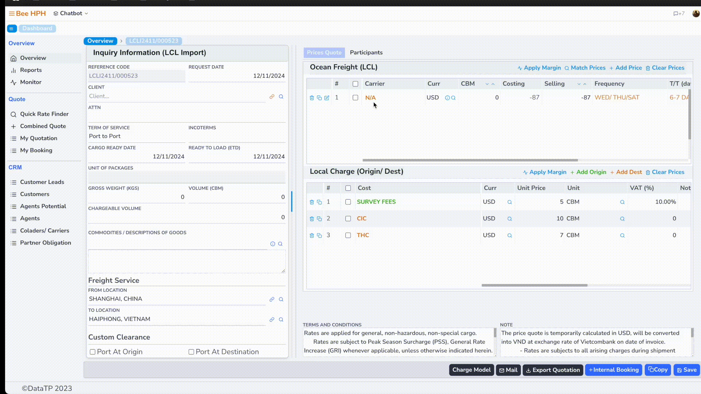
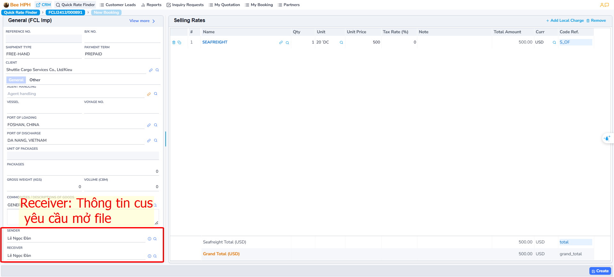

# Quy trình FCL

## 1. Tìm kiếm giá

Để tìm kiếm giá có sẵn từ hệ thống Pricing Tools (Logistics Prices), thực hiện các bước sau:

Thao tác tìm kiếm giá, check giá như đã hướng dẫn trước đó.

## 2. Tạo báo giá.

### Trường hợp 1: Có giá trong hệ thống
Sau khi check và tìm thấy giá phù hợp, anh chị click chọn vào giá đó
(có thể chọn nhiều giá từ các carrier khác nhau - đảm bảo chung tuyến).

Click tiếp nút `Request a Quote` để tiến hành tạo báo giá.

Ví dụ, thao tác chọn giá như hình. Phần mềm chuyển qua màn hình báo giá.

### Trường hợp 2: Không có giá trong hệ thống

Nếu giá không có sẵn, anh chị có thể tự tạo báo giá custom bằng cách click vào nút `Request a Quote`.

Ngoài ra, anh chị cũng có thể gửi request y/c check giá đến pricing team bằng cách click vào nút `Request Pricing`.

Màn hình báo giá gồm:

- Màn hình thông tin Inquiry (bên phải).

- Màn hình thông tin container/ bảng thông tin báo giá. (bên trái)

### Thông tin cước biển và Local Charge.

Màn hình danh sách cước Ocean Freight

(__Lưu ý__: hàng FCL, cước đã cộng thêm phần commission cho Sales của Lines).

 Màn hình Local Charge tương ứng.
 (nếu chọn nhiều giá, anh chị nhìn trên bảng Ocean Freight, Local Charge đang hiển thị tương ứng với giá có màu vàng - mỗi Local Charge tương ứng với từng giá cước)

##### (1) Ở màn hình Ocean Freight có các nút chức năng như:

- **Apply Margin** : Áp dụng tỷ lệ margin với giá gốc (percent/amount).

- **Match Price**: Tìm lại giá từ hệ thống pricing. (TH pricing đã updated bổ sung thêm giá)

- **Add Price**: Thêm giá Ocean Freight thủ công, tạo thêm dòng mới trên bảng (TH không có sẵn giá từ hệ thống pricing tools).

- **Clear Prices**: Xóa tất cả trên bảng. (chỉ xoá trên báo giá đang thực hiện, không ảnh hưởng đến dữ liệu pricing)

Ngoài ra, ở đầu mỗi dòng báo giá có các nút lần lượt là **copy, xem chi tiết, xóa**

##### (2) Các chức năng liên quan đến Local Charge:

- **Add Origin**: Thêm Local Charge at Origin.

- **Add Dest**: Thêm Local Charge at Destination.

- **Apply Margin** : Áp dụng tỷ lệ margin với giá gốc (percent/amount).

- **Clear Prices**: Xóa tất cả trên bảng.

#### Khai quan/ Trucking

Lưu ý, màn hình nhập thông tin giá Trucking có thể không hiển thị, điều này phụ thuộc vào incoterm (Tab thông tin Inquiry).

- **Add Origin**: Thêm Trucking/ Khai quan at Origin.

- **Add Dest**: Thêm Trucking/ Khai quan at Destination.

- **Clear Prices**: Xóa tất cả trên bảng.

#### Chỉnh sửa và lưu báo giá

- Sau khi chỉnh sửa xong bảng giá, nhấn **Save** để lưu báo giá.

#### Các chức năng khác

- ***Export Quotation***: Xuất thông tin báo giá.
- ***Mail***: Gửi mail cho khách hàng báo giá.
- ***Copy***: Tạo bản sao quotation.
- ***Internal Booking***: Tạo Booking trong hệ thống

## 3. Tạo IB, đẩy thông tin qua hệ thống BFSOne.

Ở màn hình Quotation, sau khi cập nhật thông tin, khách hàng confirm giá.

Anh chị tiến hành tạo IB, request cus mở File, thao tác như sau:
Tích chọn giá Freight ở màn hình danh sách, sau đó click chọn Internal Booking trên thanh công cụ,

Phần mềm chuyển qua màn hình thông tin IB:

Điền các thông tin cần thiết, sau đó nhấp **Create** để tiến hành tạo. Lưu ý rằng các thông tin bắt buộc bao gồm: Khách hàng, Đại lý, Hãng tàu/Colader, Người gửi, Người nhận, ...

Sau khi tạo, phần mềm hiển thị nút IBooking (BFSOne),
anh chị click để gửi thông tin cho customer service mở file.

