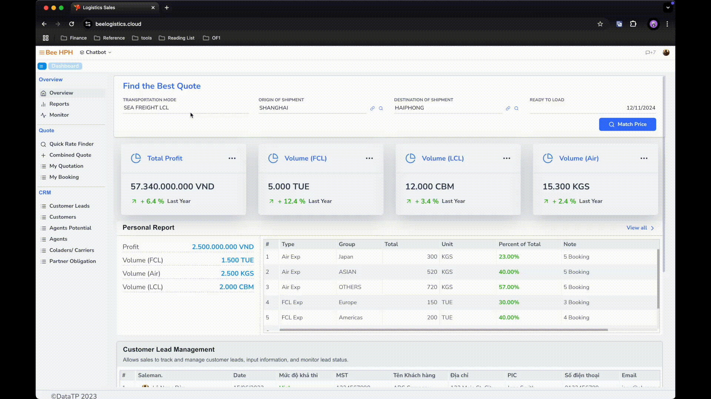
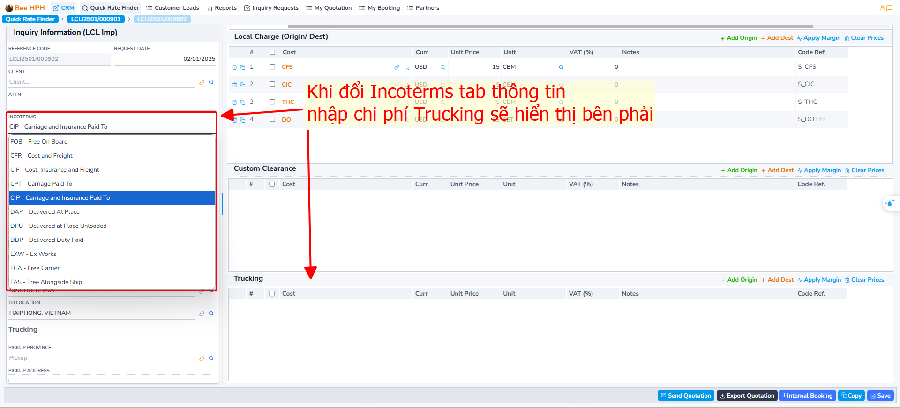
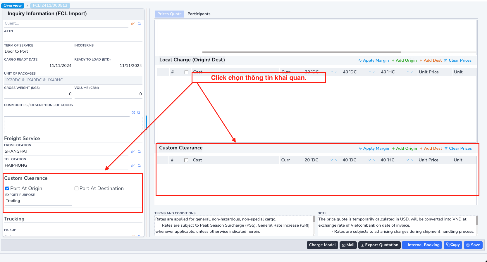
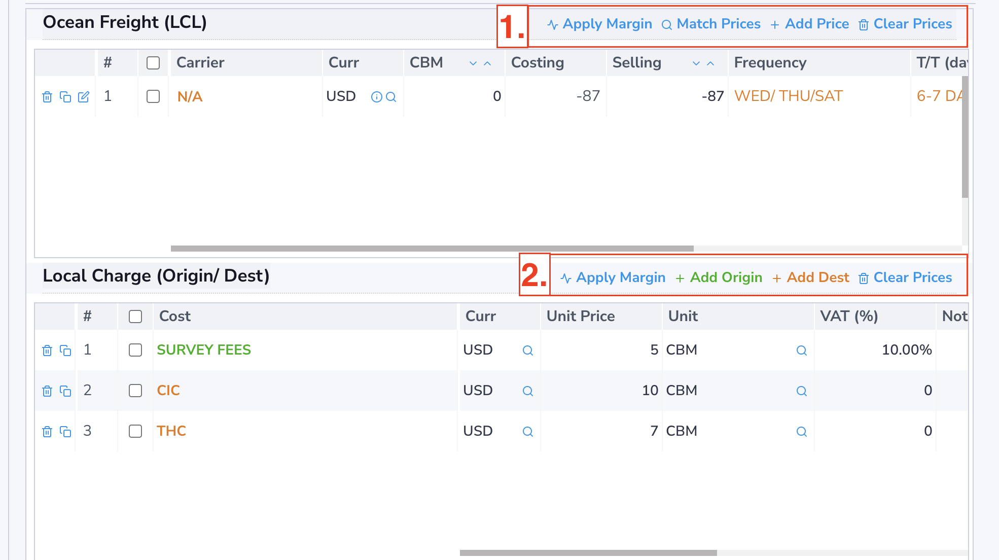
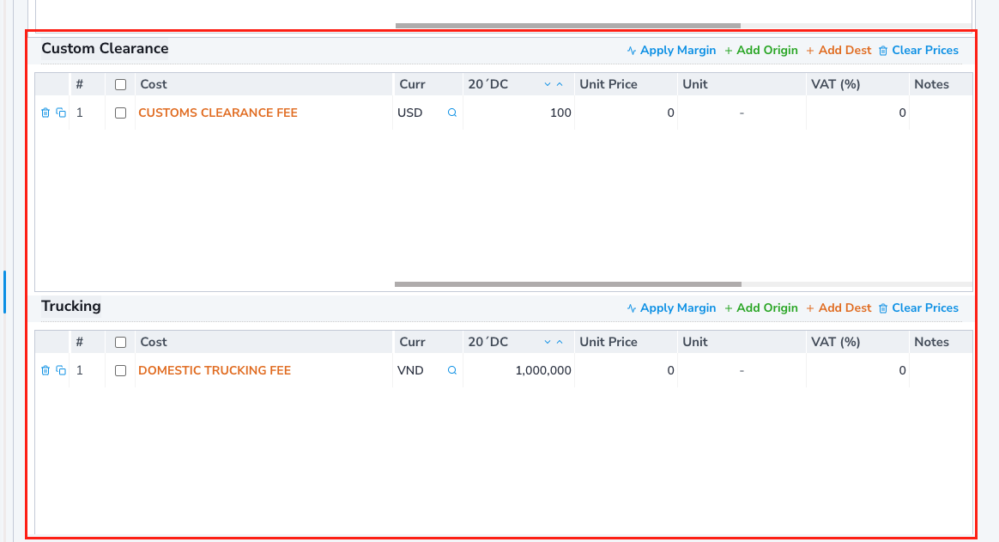
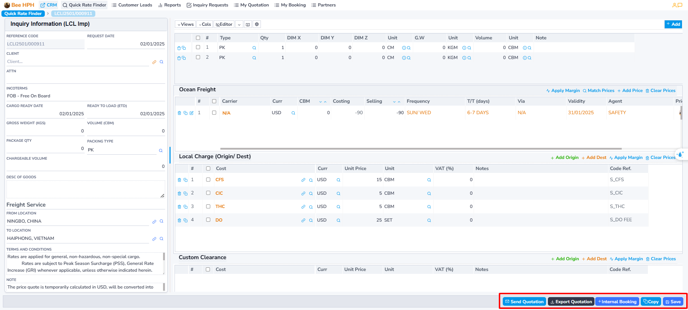
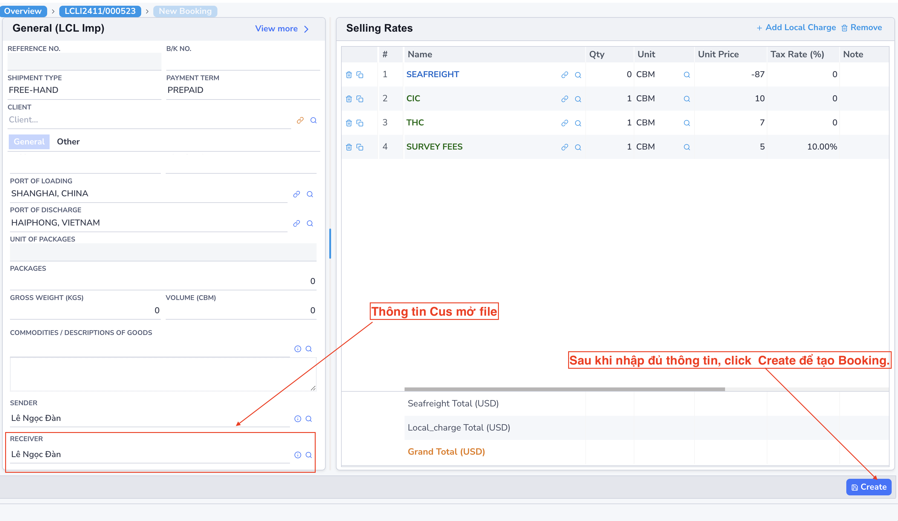

# Quy trình LCL

## 1. Tìm kiếm giá

Để tìm kiếm giá có sẵn từ hệ thống Pricing Tools (Logistics Prices), thực hiện các bước sau:

1. Trên màn hình Dashboard - Overview, trong phần Widget Match Price, nhập các thông tin cần thiết:
   - **Transportation Mode** (Loại hình vận chuyển)
   - **Origin of Shipment** (Cảng load)
   - **Destination of Shipment** (Cảng dỡ)
   - **Ready to Load** (Ngày hàng có thể vận chuyển) - phần mềm sẽ dựa vào ngày này để tìm giá hợp lệ.

2. Nhấn vào nút __`Match Price`__ để thực hiện tìm kiếm.

Ví dụ: Tìm kiếm giá **LCL Import** cho tuyến **SHANGHAI, CHINA - HAIPHONG, VIETNAM**, với ngày sẵn sàng vận chuyển là **12/11/2024**.

### Trường hợp 1: Có giá trong hệ thống

Nếu có giá trong hệ thống, phần mềm sẽ hiển thị màn hình bao gồm:

- Danh sách cước Ocean Freight.
- Màn hình Local Charge tương ứng (Lưu ý: Click từng dòng ở cột Line để xem Local Charge của dòng đó.).

Người dùng có thể chọn giá từ các Lines/Agent và
- Nhấn _`Confirm`_ để chuyển qua màn hình Quotation.
- Nhấn _`Export`_ để xuất báo giá file excel.

Hoặc có thể chỉnh sửa giá trực tiếp:

- **Add Origin/Dest**: Thêm phụ phí tại Origin/Destination.
- **Clear Prices**: Xóa phụ phí (bằng cách tick chọn).
- **Apply Margin**: Áp dụng tỷ lệ margin với giá gốc (percent/amount).

### Trường hợp 2: Không có giá trong hệ thống

Nếu không có giá sẵn, phần mềm sẽ hiển thị một popup hỏi bạn có muốn tạo mail request tới pricing team hay không. Nhấn OK để chuyển qua màn hình request, hoặc Cancel để hủy.

## 2. Tạo, xuất báo giá, gửi mail khách hàng

Sau khi **confirm** giá, phần mềm sẽ chuyển qua màn hình nhập thông tin **quotation**.

Tại đây, bạn có thể cập nhật **thông tin inquiry** ở màn hình bên trái và **thông tin container**, **báo giá** ở màn hình bên phải.

### Một số trường thông tin cần lưu ý:

- Khi thay đổi **Term Of Service** thành **Door to Port**, **Door to Door** hoặc **Port to Door**, phần mềm sẽ hiển thị thêm tab thông tin giá **Trucking** ở bên phải (cuộn để xem).

- Tương tự, khi chọn **khai quan** ở **Origin/Destination**, phần mềm cũng hiển thị thêm tab thông tin **giá khai quan**.

#### Ocean Freight/Local Charge

- Màu vàng (giá đang chọn) - đánh dấu để phân biệt cho màn hình local charge ở dưới. (Mỗi bảng giá sẽ có các local charge riêng biệt)
- Thay đổi tùy chọn bằng cách click vào biểu tượng.
- Các nút chức năng bên cạnh lần lượt là ***copy, xem chi tiết, xóa*** theo thứ tự.

##### (1) Các chức năng liên quan đến cước.

- **Match Price**: Tìm lại giá từ hệ thống pricing.

- **Add Price**: Thêm giá (Ocean Freight) thủ công (tạo thêm dòng mới trên bảng).

- **Clear Prices**: Xóa tất cả trên bảng.

##### (2) Các chức năng liên quan đến Local Charge:
- **Add Origin**: Thêm Local Charge at Origin.

- **Add Dest**: Thêm Local Charge at Destination.

- **Clear Prices**: Xóa tất cả trên bảng.

#### Khai quan/ Trucking

- **Add Origin**: Thêm Trucking/ Khai quan at Origin.

- **Add Dest**: Thêm Trucking/ Khai quan at Destination.

- **Clear Prices**: Xóa tất cả trên bảng.

#### Tab Participants (Pending)

Tab này liên quan đến thông tin và phân quyền cho người tham gia để xử lý báo giá này, bao gồm các quy trình tạo báo giá, nhập thông tin và các quy trình tiếp theo như tạo booking, bill, v.v.

#### Chỉnh sửa và lưu báo giá

- Sau khi chỉnh sửa xong bảng giá, nhấn **Save** để lưu báo giá.

#### Các chức năng khác

- ***Export Quotation***: Xuất thông tin báo giá.
- ***Mail***: Gửi mail cho khách hàng báo giá.
- ***Copy***: Tạo bản sao quotation.
- ***Internal Booking***: Tạo Booking trong hệ thống

## 3. Tạo IB, đẩy thông tin qua hệ thống BFSOne.

Ở màn hình Quotation, sau khi cập nhật thông tin, khách hàng confirm giá.

Anh chị tiến hành tạo IB, request cus mở File, thao tác như sau:
Tích chọn giá Freight ở màn hình danh sách, sau đó click chọn Internal Booking trên thanh công cụ

Phần mềm chuyển qua màn hình thông tin IB:

Điền các thông tin cần thiết, sau đó nhấp **Create** để tiến hành tạo. Lưu ý rằng các thông tin bắt buộc bao gồm: Khách hàng, Đại lý, Hãng tàu/Colader, Người gửi, Người nhận, ...

Sau khi tạo, phần mềm hiển thị nút IBooking (BFSOne),
anh chị click để gửi thông tin cho customer service mở file.

