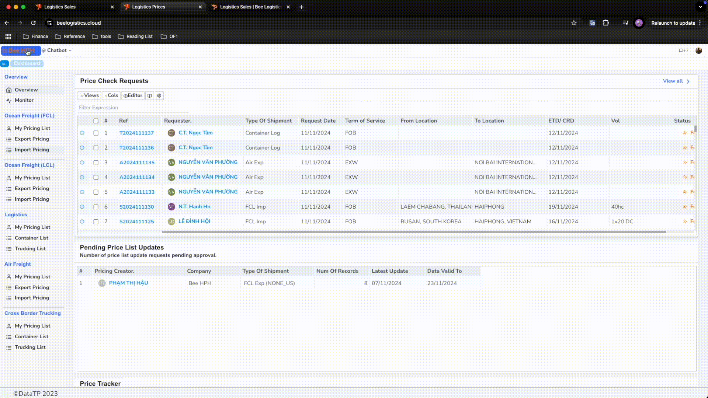

# Tìm kiếm giá (Sales)

Dưới đây là hướng dẫn chi tiết về cách sử dụng các tính năng tìm kiếm giá trên hệ thống dành cho Sales.

## Truy cập module Sales

a. Góc trái màn hình, click chọn ở logo tên công ty để vào danh sách module.

b. Click chọn module Logistics Sales, phần mềm vào màn hình mặc định Dashboard - Overview

_Báo IT support nếu bạn không nhìn thấy Module Sales trên màn hình danh sách modules._

## Giao diện tổng quan
Ở màn hình Dashboard, chọn `Quick Rate Finder` trên Sidebar bên phải để vào màn hình tìm kiếm giá.

Mặc định, hệ thống sẽ hiển thị các giá đang có hiệu lực (ngày hết hạn lớn hơn ngày hiện tại).

Nhập các thông tin cần thiết:
   - **Origin of Shipment** (Cảng load)
   - **Destination of Shipment** (Cảng dỡ)
   - **Ready to Load** (Ngày hàng có thể vận chuyển) - phần mềm sẽ dựa vào ngày này để tìm giá hợp lệ.

Hoặc tìm kiếm bổ sung bằng tuỳ chọn `Tìm kiếm nhanh`:

Chỉ cần nhập từ khóa cần tìm, hệ thống sẽ tự động lọc và hiển thị các kết quả phù hợp.

Lưu ý quan trọng:

Tính năng tìm kiếm nhanh chỉ thực hiện tìm kiếm trên dữ liệu đang được hiển thị trên màn hình hiện tại,
không thực hiện tìm kiếm trong toàn bộ cơ sở dữ liệu. Điều này giúp tăng tốc độ tìm kiếm và cho kết quả ngay lập tức.

### 3. Các tính năng hỗ trợ

- **Yêu cầu kiểm tra giá**: Bạn có thể gửi yêu cầu kiểm tra giá đến Pricing Team bằng cách nhấn nút "Request Pricing". Hệ thống sẽ tự động gửi email yêu cầu.

- **Tạo báo giá**: Để tạo báo giá mới:
  1. Chọn mức giá phù hợp từ bảng giá
  2. Nhấn nút "Request a Quote"
  3. Hệ thống sẽ chuyển bạn đến màn hình tạo báo giá

- **Xuất báo giá**: Để xuất báo giá ra file Excel:
  1. Chọn mức giá cần xuất
  2. Nhấn nút "Export a Quote"
  3. File Excel sẽ được tải về máy của bạn

Chi tiết về cách sử dụng, vui lòng tham khảo [hướng dẫn tại đây](/docs/crm/prices/mail_request).

### 4. Xem biến động giá FCL Export

Bạn có thể xem biến động giá theo thời gian bằng cách:

1. Vào màn hình tìm kiếm giá FCL Export
2. Nhấn nút "Analysis"

Màn hình sẽ hiển thị:
- Danh sách giá trước và sau thời điểm hiện tại
- Giá bạn đang chọn sẽ được tô màu vàng
- Cột "Comparison" cho biết % chênh lệch so với giá đang chọn

- Để so sánh giá giữa các hãng tàu khác nhau, bạn có thể bỏ trống thông tin ở cột Carrier trong màn hình lọc. Điều này giúp bạn dễ dàng đánh giá và lựa chọn mức giá tốt nhất giữa các Lines.

**Demo:**

[https://youtu.be/ysdnwKeK9PM](https://youtu.be/ysdnwKeK9PM)

  

    <iframe
          style={{ position: 'absolute', top: 0, left: 0, width: '100%', height: '100%' }}
          src="https://www.youtube.com/embed/ysdnwKeK9PM"
          frameBorder="0"
          allow="accelerometer; autoplay; clipboard-write; encrypted-media; gyroscope; picture-in-picture"
          allowFullScreen />
  

#### Hướng dẫn quy trình tạo báo giá theo loại hình

Tùy theo loại hình vận chuyển, vui lòng tham khảo hướng dẫn chi tiết:

- **Vận chuyển FCL (Full Container Load)**: [Xem hướng dẫn chi tiết tại đây](/docs/crm/sales/fcl_process)
  - Quy trình tìm giá
  - Tạo và xuất báo giá
  - Tạo Internal Booking

- **Vận chuyển LCL (Less Container Load)**: [Xem hướng dẫn chi tiết tại đây](/docs/crm/sales/lcl_process)
  - Quy trình tìm giá
  - Tạo và xuất báo giá
  - Tạo Internal Booking

- **Vận chuyển hàng không (Air Freight)**: [Xem hướng dẫn chi tiết tại đây](/docs/crm/sales/air_process)
  - Quy trình tìm giá
  - Tạo và xuất báo giá
  - Tạo Internal Booking

- **Vận chuyển đường bộ (Trucking)**: [Xem hướng dẫn chi tiết tại đây](/docs/crm/sales/trucking_process)
  - Quy trình tìm giá
  - Tạo và xuất báo giá
  - Tạo Internal Booking
