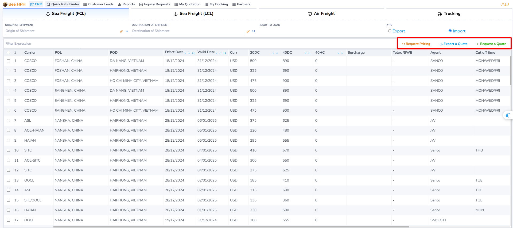

# Tìm kiếm giá (Sales)

Dưới đây là hướng dẫn chi tiết về cách sử dụng các tính năng tìm kiếm giá trên hệ thống dành cho Sales.

## Truy cập module Sales

a. Góc trái màn hình, click chọn ở logo tên công ty để vào danh sách module.

b. Click chọn module Logistics Sales, phần mềm vào màn hình mặc định Dashboard - Overview

_Báo IT support nếu bạn không nhìn thấy Module Sales trên màn hình danh sách modules._

## Giao diện tổng quan
Ở màn hình Dashboard, chọn `Quick Rate Finder` trên Sidebar bên phải để vào màn hình tìm kiếm giá.

Mặc định, hệ thống sẽ hiển thị các giá đang có hiệu lực (ngày hết hạn lớn hơn ngày hiện tại).

Nhập các thông tin cần thiết:
   - **Origin of Shipment** (Cảng load)
   - **Destination of Shipment** (Cảng dỡ)
   - **Ready to Load** (Ngày hàng có thể vận chuyển) - phần mềm sẽ dựa vào ngày này để tìm giá hợp lệ.

Hoặc tìm kiếm bổ sung bằng tuỳ chọn `Tìm kiếm nhanh`:

Chỉ cần nhập từ khóa cần tìm, hệ thống sẽ tự động lọc và hiển thị các kết quả phù hợp.

Lưu ý quan trọng:

Tính năng tìm kiếm nhanh chỉ thực hiện tìm kiếm trên dữ liệu đang được hiển thị trên màn hình hiện tại,
không thực hiện tìm kiếm trong toàn bộ cơ sở dữ liệu. Điều này giúp tăng tốc độ tìm kiếm và cho kết quả ngay lập tức.

### 3. Các tính năng bổ sung

- **Yêu cầu check giá**: Thông qua nút Request Pricing, bạn có thể gửi yêu cầu kiểm tra giá qua email trực tiếp đến Pricing Team.

- **Yêu cầu báo giá**: Tạo báo giá bằng cách click chọn giá cần báo ở bảng giá, sau đó click `Request a Quote`, phần mềm sẽ chuyển qua màn hình Quotation.

- **Confirm giá (Pending)**: Gửi mail đến pricing input giá để review, confirm lại giá trước khi báo cho khách.

Chi tiết về cách sử dụng, vui lòng tham khảo [hướng dẫn tại đây](/docs/crm/prices/mail_request).

#### Hướng dẫn quy trình tạo báo giá theo loại hình

Tùy theo loại hình vận chuyển, vui lòng tham khảo hướng dẫn chi tiết:

- **Vận chuyển FCL (Full Container Load)**: [Xem hướng dẫn chi tiết tại đây](/docs/crm/sales/fcl_process)
  - Quy trình tìm giá
  - Tạo và xuất báo giá
  - Tạo Internal Booking

- **Vận chuyển LCL (Less Container Load)**: [Xem hướng dẫn chi tiết tại đây](/docs/crm/sales/lcl_process)
  - Quy trình tìm giá
  - Tạo và xuất báo giá
  - Tạo Internal Booking

- **Vận chuyển hàng không (Air Freight)**: [Xem hướng dẫn chi tiết tại đây](/docs/crm/sales/air_process)
  - Quy trình tìm giá
  - Tạo và xuất báo giá
  - Tạo Internal Booking

- **Vận chuyển đường bộ (Trucking)**: [Xem hướng dẫn chi tiết tại đây](/docs/crm/sales/trucking_process)
  - Quy trình tìm giá
  - Tạo và xuất báo giá
  - Tạo Internal Booking
