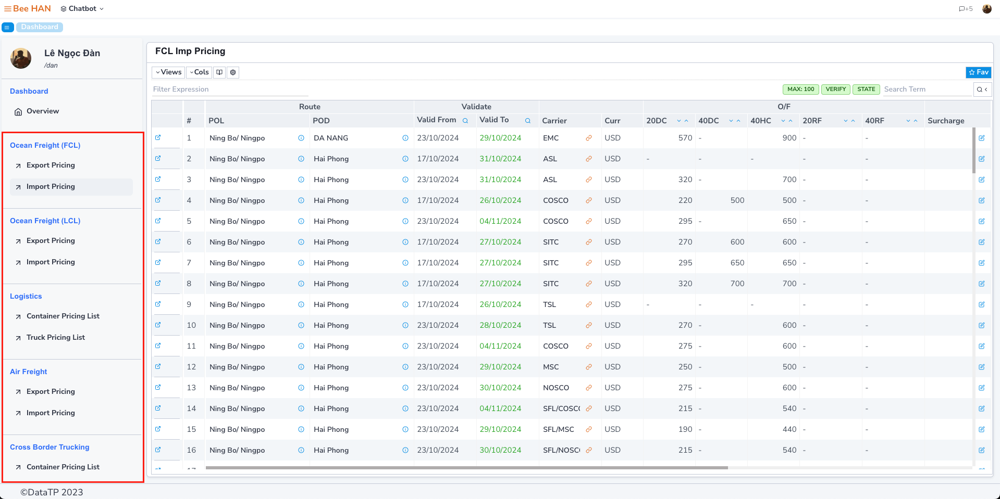

# Prices: Tìm kiếm giá

Ở màn hình Dashboard của module, bên sidebar là danh sách các màn hình giá được chia theo từng loại hình.

Giả dụ chọn Import Pricing, màn hình danh sách giá tương ứng hiển thị ở bên phải.

Mặc định phần mềm sẽ hiển thị giá đang valid (có ngày valid to > ngày hiện tại).

Để tìm kiếm giá, chúng ta có các cách thức như sau:

1. Thanh tìm kiếm nhanh (tìm kiếm bằng cách gõ văn bản và phần mềm sẽ tìm kiếm tất cả thông tin trên màn hình theo thông tin vừa nhập - chỉ tìm kiếm thông tin có sẵn trên màn hình).
2. Thanh tìm kiểu theo từng tiêu chí khác nhau:

    Click biểu tượng kính lúc bên góc phải (như hình dưới). Màn hình hiển thị màn hình tiêu chí tìm kiếm bao gồm:

    - **Carrier, Agent:** tìm kiếm theo Lines, Agents, nhập text
    - **Pricing Creator: tìm kiếm theo người input giá, nhập theo danh sách.**
    - **Ready To Load:** ngày hàng ready, phần mềm dựa theo ngày này để tìm kiếm tất cả giá trong hệ thống thoả mãn `ngày tạo < ready to load < ngày valid to`
    - **From Location, To Location:** Tìm kiếm theo thông tin cảng load, cảng dỡ.
    - **Valid To:** Tìm kiếm giá theo khoảng ngày, mặc định lock, mở bằng cách xoá giá trị ở Ready To Load (chỉ sử dụng 1 trong 2 tiêu chí, không sử dụng đồng thời).
    - **Verify:**
        - Waiting: Bảng giá chưa được approve
        - Verified: Bảng giá đã được approve.
    - **Max Return:** Số lượng dữ liệu hiển thị trên bảng.

Sau khi nhập các tiêu chí tìm kiếm, click nút search để tìm kiếm.

Các màn hình khác, cách theo tác tương tự.
