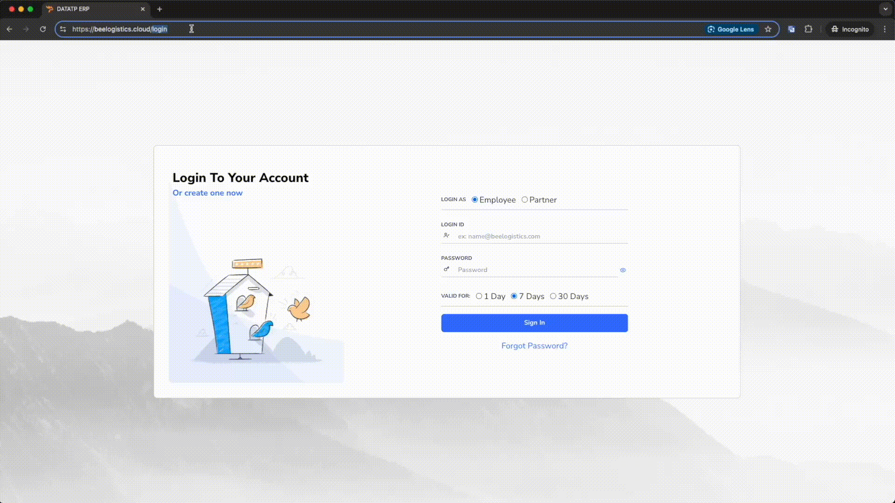

# System

Chào mừng bạn đến với hướng dẫn sử dụng hệ thống Bee Logistics. Trong hướng dẫn này, chúng tôi sẽ giúp bạn bắt đầu sử dụng hệ thống một cách nhanh chóng và hiệu quả.

## Truy cập hệ thống

Để bắt đầu sử dụng Bee Logistics, hãy làm theo các bước sau:

1. Mở trình duyệt web của bạn (Google Chrome, Firefox, Safari, v.v.).
2. Nhập địa chỉ https://beelogistics.cloud vào thanh địa chỉ.
3. Nhấn Enter để truy cập trang web chính thức của Bee Logistics.

## Đăng nhập hệ thống

Sau khi truy cập trang web, bạn cần đăng nhập để sử dụng các tính năng của hệ thống:

1. Tại trang chủ, tìm và nhấp vào nút "Đăng nhập" hoặc "`Login`".
2. Nhập thông tin đăng nhập của bạn:
   - Tên đăng nhập (`Username`): [Tên đăng nhập được cấp]
   - Mật khẩu (`Password`): [Mật khẩu của bạn]
3. Nhấp vào nút "Đăng nhập" để truy cập vào hệ thống.

### Lưu ý:
- Nếu bạn quên mật khẩu, hãy sử dụng tính năng "Quên mật khẩu" trên trang đăng nhập.
- Đảm bảo giữ bí mật thông tin đăng nhập của bạn và không chia sẻ với người khác.

## Bắt đầu sử dụng

Sau khi đăng nhập thành công, bạn sẽ được chuyển đến trang chính của hệ thống Bee Logistics. Từ đây, bạn có thể:

- Khám phá các tính năng và module khác nhau của hệ thống.
- Tùy chỉnh thông tin cá nhân và cài đặt tài khoản.
- Bắt đầu sử dụng các công cụ và chức năng để quản lý công việc logistics của bạn.

Để được hỗ trợ thêm, vui lòng tham khảo các hướng dẫn chi tiết trong phần Tài liệu hoặc liên hệ với đội ngũ hỗ trợ của chúng tôi.
