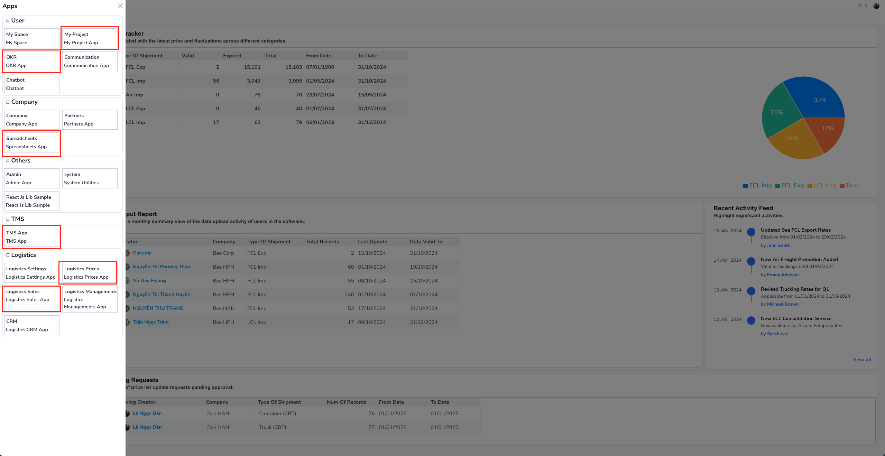

# System

Chào mừng bạn đến với hướng dẫn sử dụng hệ thống Bee Logistics. Trong hướng dẫn này, chúng tôi sẽ giúp bạn bắt đầu sử dụng hệ thống một cách nhanh chóng và hiệu quả.

## Truy cập hệ thống

Để bắt đầu sử dụng Bee Logistics, hãy làm theo các bước sau:

1. Mở trình duyệt web của bạn (Google Chrome, Firefox, Safari, v.v.).
2. Nhập địa chỉ https://beelogistics.cloud vào thanh địa chỉ.
3. Nhấn Enter để truy cập trang web chính thức của Bee Logistics.

## Đăng nhập hệ thống

Sau khi truy cập trang web, bạn cần đăng nhập để sử dụng các tính năng của hệ thống:

1. Tại trang chủ, nhập thông tin đăng nhập của bạn:
   - Tên đăng nhập (`Username`): [Tên đăng nhập được cấp]
   - Mật khẩu (`Password`): [Mật khẩu của bạn]
2. Nhấp vào nút "Đăng nhập" để truy cập vào hệ thống.

### Lưu ý:
- Nếu bạn quên mật khẩu, hãy sử dụng tính năng "Quên mật khẩu" trên trang đăng nhập.
- Đảm bảo giữ bí mật thông tin đăng nhập của bạn và không chia sẻ với người khác.

## Bắt đầu sử dụng

Sau khi đăng nhập thành công, bạn sẽ được chuyển đến trang chính của hệ thống Bee Logistics. Từ đây, bạn có thể:

### Tùy chỉnh thông tin cá nhân và cài đặt tài khoản

Sau khi đăng nhập thành công, bạn có thể tùy chỉnh thông tin cá nhân và cài đặt tài khoản của mình để tối ưu hóa trải nghiệm sử dụng hệ thống:

1. Cập nhật thông tin cá nhân: (Pending)
   - Tên hiển thị
   - Địa chỉ email chính
   - Thông tin liên hệ (số điện thoại, địa chỉ)
   - Ảnh đại diện

2. Thiết lập kết nối với các ứng dụng:
   - Email/Outlook: Để nhận thông báo và gửi email trực tiếp từ hệ thống
   - Zalo: Tích hợp nhắn tin và thông báo qua Zalo
   - Teams: Đồng bộ lịch và thông báo với Microsoft Teams

Xem video hướng dẫn chi tiết dưới đây:

3. Cài đặt thông báo: (Pending)
   - Tùy chỉnh loại thông báo bạn muốn nhận
   - Chọn phương thức nhận thông báo (email, Zalo, hoặc cả hai)
   - Điều chỉnh tần suất nhận thông báo

### Danh sách module chức năng.

Bắt đầu sử dụng các công cụ và chức năng để quản lý công việc logistics của bạn.

Trên đây là danh sách các app với các nghiệp vụ chuyên biệt bao gồm:

1. My Project, Spreadsheet là các phần liên quan đến tích đầu việc, theo dõi file thay thế file excel (theo cách cũ)

2. OKR - theo dõi mục tiêu và kết quả

3. TMS - phần mềm liên quan đến quản lý bill vận tải, đội xe

4. Logistics Prices - Pricing Tools: Quản lý giá từ Line/ Airline/ Thầu phụ

5. Logistics Sales: quản lý inquiry, báo giá, IB.

Để được hỗ trợ thêm, vui lòng tham khảo các hướng dẫn chi tiết trong phần Tài liệu hoặc liên hệ với đội ngũ hỗ trợ của chúng tôi.
