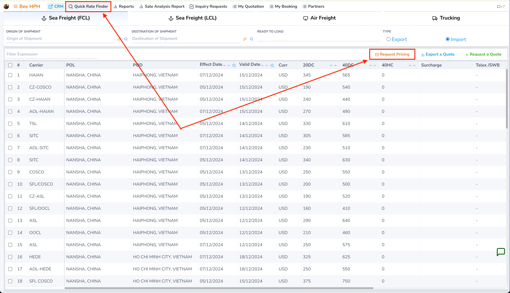
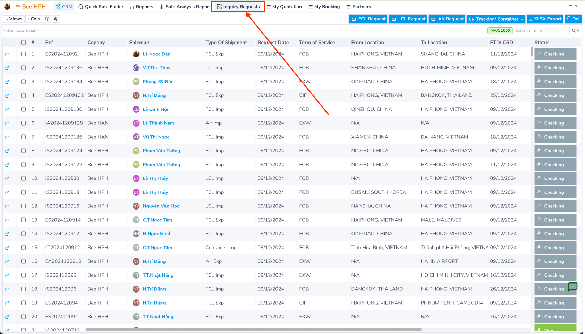
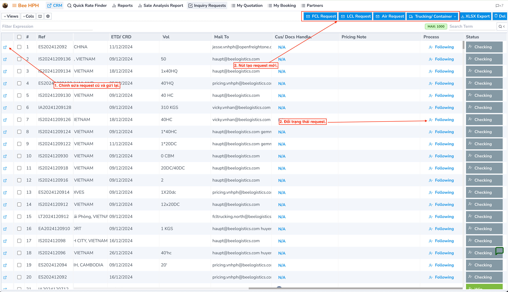

# Mail Request

Detailed instructions on how to use features related to **email/outlook** integration on **Logistics Prices**.

## Mail Request Pricing Feature (Price Check)

When you cannot find a suitable price for a specific shipping route, you can use the **Request Pricing** feature to send a price inquiry via email.

### Process

1. On the price search screen, perform a search for the route you need a quote for.
2. If there are no suitable results, click the `Request Pricing` button on the toolbar to open the request form.

### Price Inquiry Form

#### 1. Sender/Recipient Information
- **From (Email)**: Email of the person sending the request
- **TO**: Main email of the Pricing team _(automatically filled according to the route)_
- **TO (External Email)**: Additional recipient email (outside the system)
- **CC**: CC email within the system
- **CC (External Email)**: Additional CC email (outside the system)

#### 2. Attachments
- **Attachments**: Upload attachments (maximum 35MB)
  - Drag and drop files directly into the form
  - Or select files from your computer

> **Note**: After filling in all the information, click `Send Request` to send the inquiry.

### Demo

## Managing Sent Requests

### Reviewing Requests
On the menu bar, select **Inquiry Requests**, where you can review the list of previously sent requests:

#### Available functions on the screen.
1. Edit and resend old requests (processed as a new request).

To avoid re-entering information when sending a similar request:
- Click the icon at the beginning of each line, the system will automatically fill in information from the previous request.
- Update necessary information and send a new request.

2. Open the form and create a new request (as per the instructions provided).
3. Change the process of the Request.
- In case the sent information is incorrect, change the status to `Reject`.
- Change by clicking on the status information in the Process column.

### Auto-fill Feature
- When creating a new request, the system will automatically check for similar requests sent previously.
- If found, the system will display a notification popup.
- Click `OK` to automatically fill in information from the old request into the new form.
- Helps save time and ensure information consistency.

