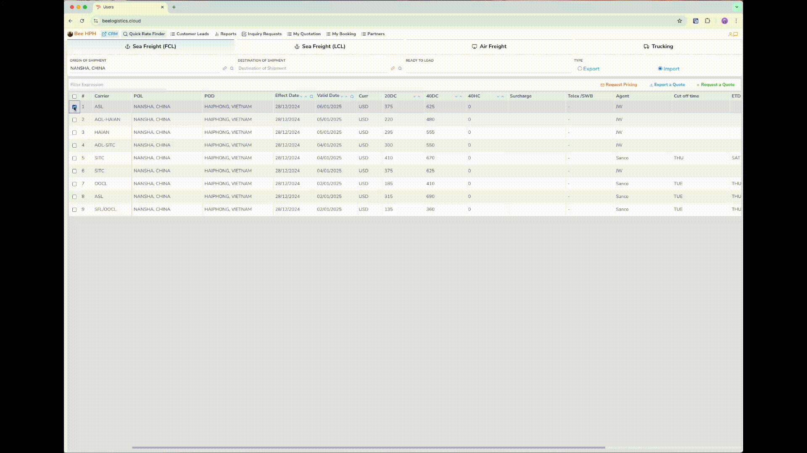
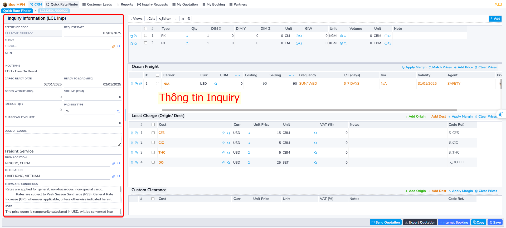
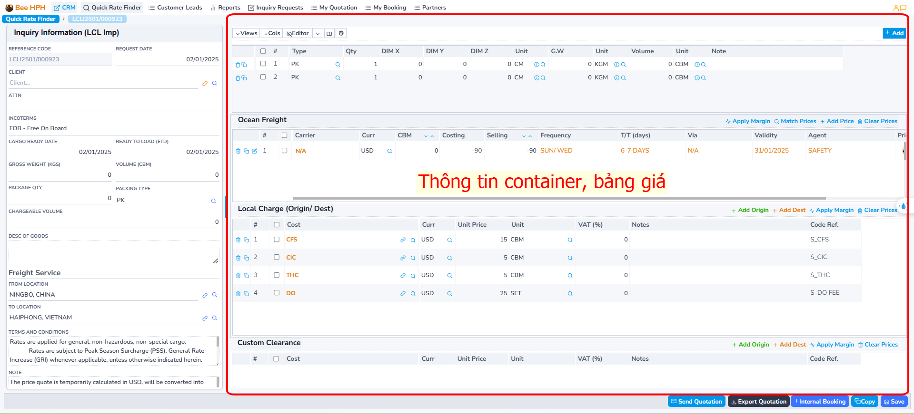
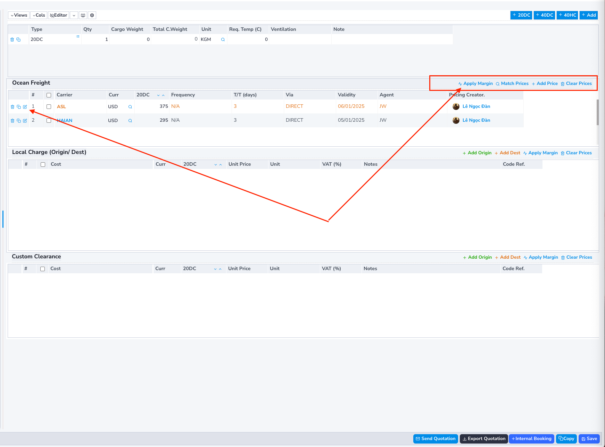
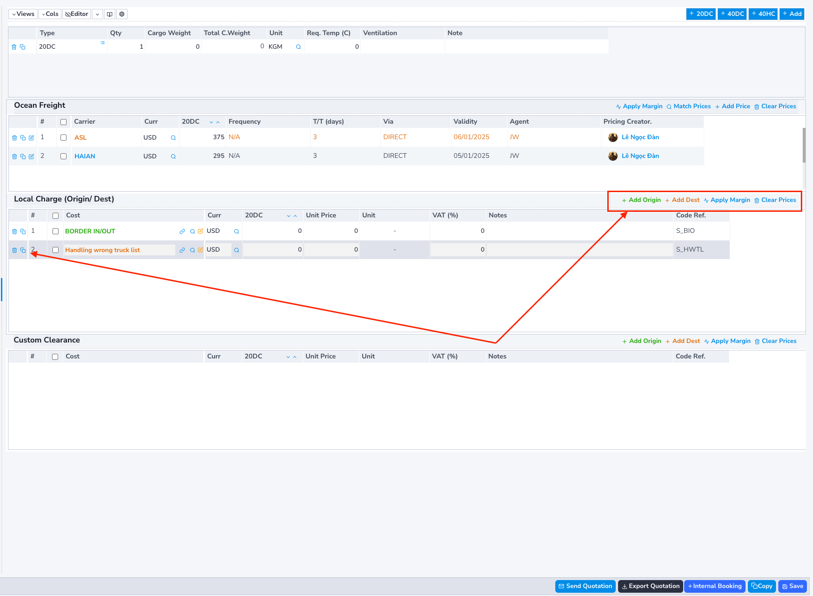
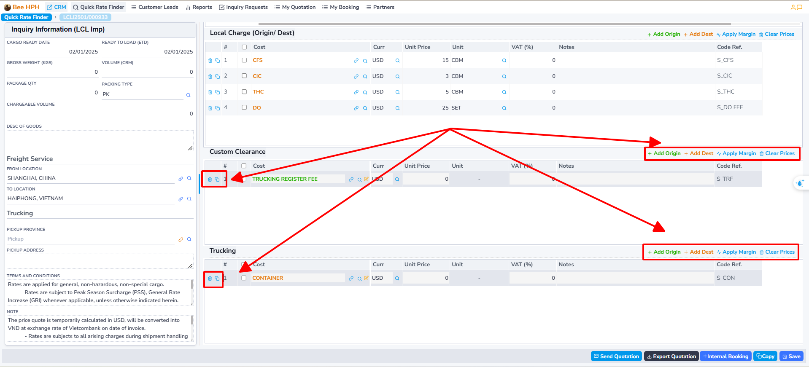
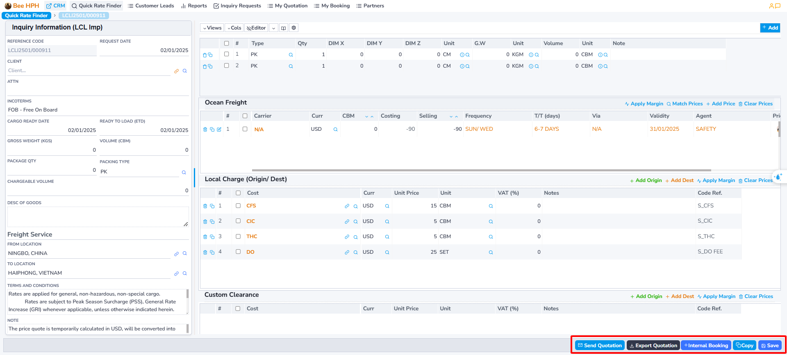
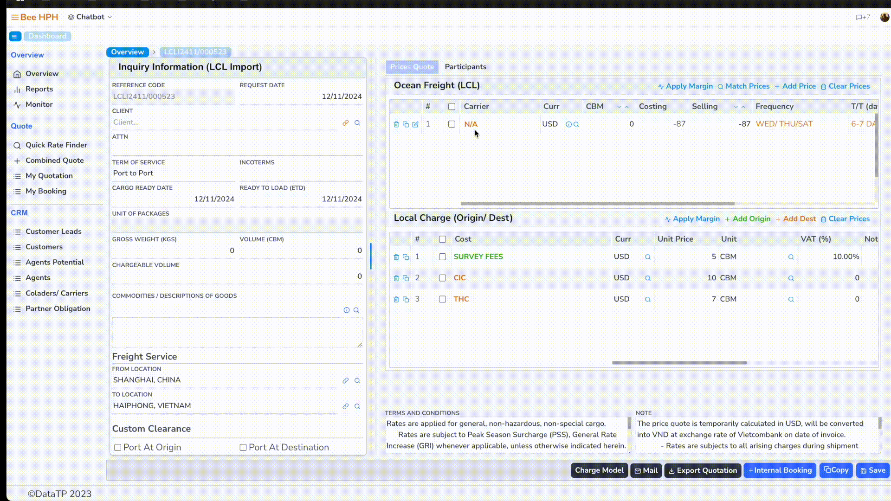
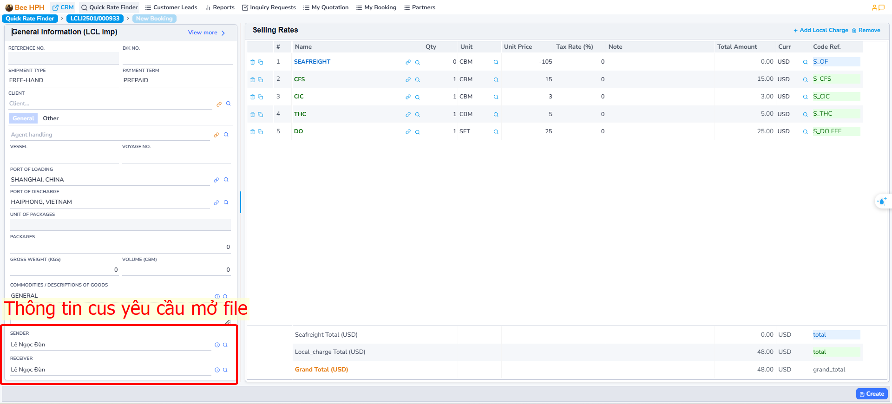
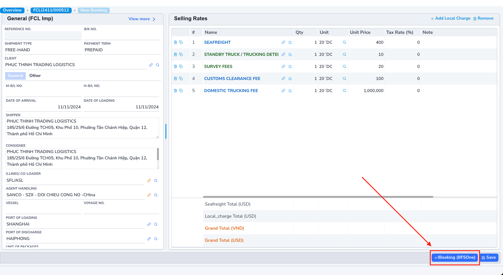

# LCL Process

## 1. Price Search

To search for available prices from the Pricing Tools system (Logistics Prices), follow these steps:

Perform the price search and check as previously instructed.

## 2. Create a Quote

### Case 1: Price Available in the System
After checking and finding a suitable price, click on that price
(you can select multiple prices from different carriers - ensuring the same route).

Then click the `Request a Quote` button to proceed with creating a quote.

For example, the action of selecting a price as shown. The software transitions to the quote screen.

### Case 2: Price Not Available in the System

If the price is not available, you can create a custom quote by clicking the `Request a Quote` button.

Additionally, you can send a request to check the price to the pricing team by clicking the `Request Pricing` button.

The quote screen includes:

- Inquiry information screen (on the right).

- Container information screen/quote information table (on the left).

### Ocean Freight and Local Charge Information

Ocean Freight list screen

(__Note__: For LCL goods, the freight includes a commission for the Sales of the Lines).

Corresponding Local Charge screen.
(if selecting multiple prices, look at the Ocean Freight table, the Local Charge is displayed corresponding to the price highlighted in yellow - each Local Charge corresponds to each freight price)

##### (1) On the Ocean Freight screen, there are function buttons such as:

- **Apply Margin**: Apply a margin rate to the base price (percent/amount).

- **Match Price**: Re-find the price from the pricing system. (In case pricing has been updated with additional prices)

- **Add Price**: Manually add Ocean Freight price, creating a new line on the table (In case there is no available price from the pricing tools system).

- **Clear Prices**: Clear all on the table. (only clears on the current quote, does not affect pricing data)

Additionally, at the beginning of each quote line, there are buttons for **copy, view details, delete**

##### (2) Functions related to Local Charge:

- **Add Origin**: Add Local Charge at Origin.

- **Add Dest**: Add Local Charge at Destination.

- **Apply Margin**: Apply a margin rate to the base price (percent/amount).

- **Clear Prices**: Clear all on the table.

#### Customs/Trucking

Note, the Trucking price information entry screen may not display, depending on the incoterm (Inquiry information tab).

- **Add Origin**: Add Trucking/Customs at Origin.

- **Add Dest**: Add Trucking/Customs at Destination.

- **Clear Prices**: Clear all on the table.

#### Edit and Save Quote

- After editing the price table, press **Save** to save the quote.

#### Other Functions

- ***Export Quotation***: Export quotation information.
- ***Mail***: Send quotation email to the customer.
- ***Copy***: Create a copy of the quotation.
- ***Internal Booking***: Create a Booking in the system

## 3. Create IB, Push Information to BFSOne System.

On the Quotation screen, after updating the information, the customer confirms the price.

Proceed to create IB, request the customer to open the File, as follows:
Select the Freight price on the list screen, then click Internal Booking on the toolbar,

The software transitions to the IB information screen:

Fill in the necessary information, then click **Create** to proceed. Note that the required information includes: Customer, Agent, Shipping Line/Colader, Shipper, Consignee, ...

After creation, the software displays the IBooking (BFSOne) button,
click to send information to customer service to open the file.

