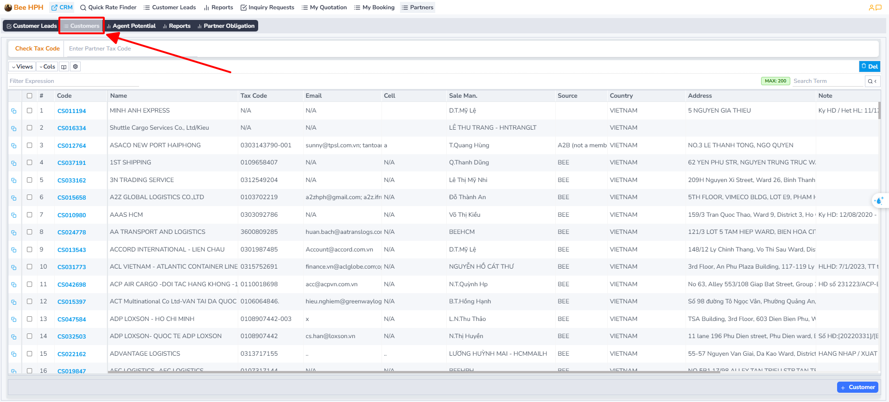
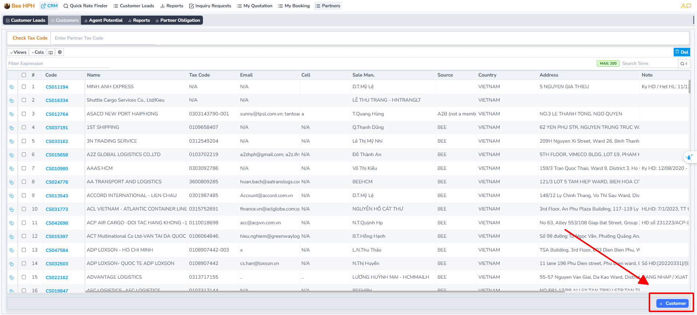
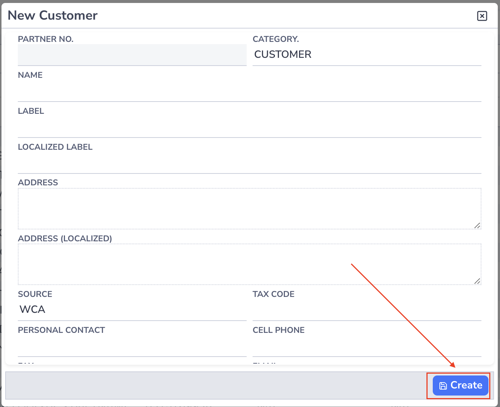

# Overview

Logistics Sales is a module for managing the sales process, from price inquiry, quote creation to internal booking creation. This module helps you:

- Manage customer information
- Create and manage quotes
- Handle the booking process
- Track order status

## Guide Content

### 1. Access the business module

a. In the top left corner of the screen, click on the company logo to access the module list.

b. Click on the Logistics Sales module, the software will enter the default Dashboard - Overview screen.

#### Check customer information

Before starting to create a quote, you need to check the customer information assigned in the __Customers__ section:

Note: Customer information is automatically synchronized from the BFSOne system. If there are any errors or updates needed, please contact IT for support.

### 2. Find prices, create/export quotes, create Internal Booking.

#### Quote management policy

- Each quote has only one owner
- The owner has full rights to view and manage their quote
- Other users cannot view/edit quotes not under their management
- This permission ensures information security

#### Detailed instructions by type

Depending on the type of transportation, please refer to the detailed instructions:

- **FCL (Full Container Load) Transport**: [See detailed instructions here](/docs/crm/sales/fcl_process)
  - Price inquiry process
  - Create and export quotes
  - Create Internal Booking

- **LCL (Less Container Load) Transport**: [See detailed instructions here](/docs/crm/sales/lcl_process)
  - Price inquiry process
  - Create and export quotes
  - Create Internal Booking

- **Air Freight Transport**: [See detailed instructions here](/docs/crm/sales/air_process)
  - Price inquiry process
  - Create and export quotes
  - Create Internal Booking

- **Trucking Transport**: [See detailed instructions here](/docs/crm/sales/trucking_process)
  - Price inquiry process
  - Create and export quotes
  - Create Internal Booking

### 3. Request to create a new customer

Click on **Menu Customers** in the **Sidebar**.

On the **Customers list** screen, under the toolbar, click on **New Customer** to request the creation of a **new customer**.

The software will display an **information form** to be filled out. Please complete the information and click **Create** to submit the **request**.

After clicking **"Create"** to submit the request, the system will send the information to **BFSOne** for approval from an authorized person.

Once the request is approved, you can use this customer information for your **quotes**.