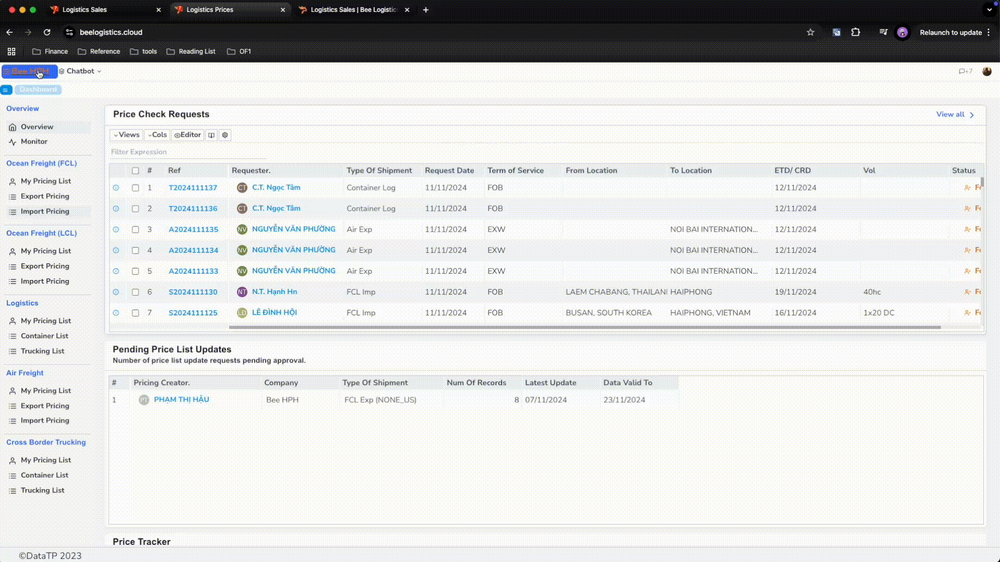
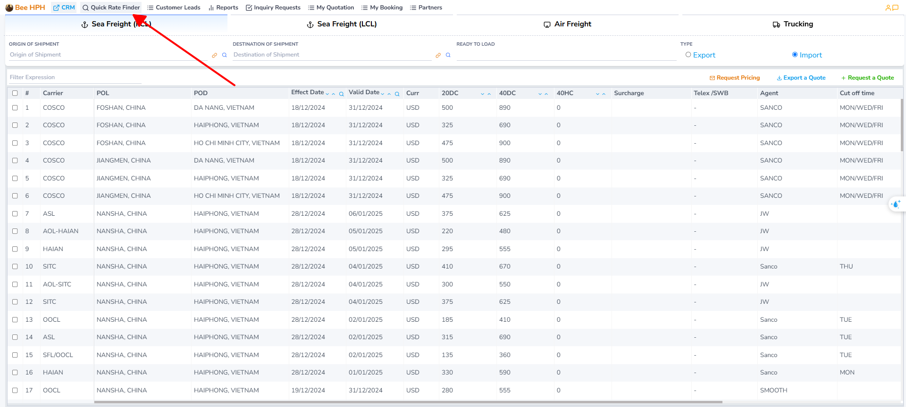
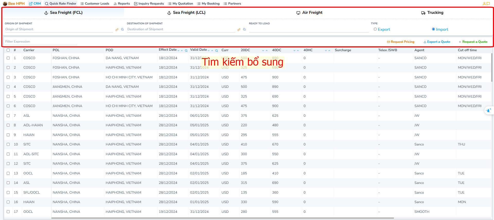
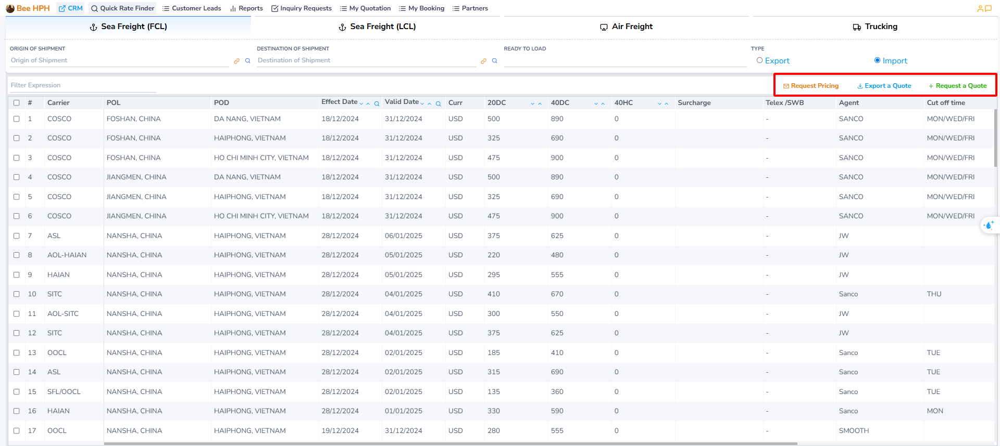
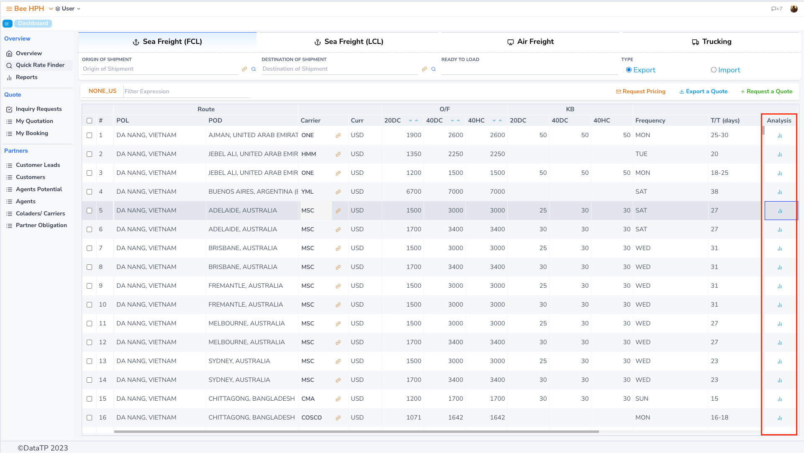

# Price Search (Sales)

Below is a detailed guide on how to use the price search features in the system for Sales.

## Access the Sales module

a. In the top left corner of the screen, click on the company logo to access the module list.

b. Click on the Logistics Sales module, the software will enter the default Dashboard - Overview screen.

_Report to IT support if you do not see the Sales Module on the module list screen._

## Overview Interface

On the Dashboard screen, select `Quick Rate Finder` on the right Sidebar to enter the price search screen.

By default, the system will display prices that are currently valid (expiration date is later than the current date).

At the top of the interface are the types of transportation including `Sea Freight (FCL)`, `Sea Freight (LCL)`, `Air Freight`, and `Trucking`.

Please click on the type of transportation that suits your needs.

Next, please enter the necessary information:
   - **Origin of Shipment** (Loading Port)
   - **Destination of Shipment** (Unloading Port)
   - **Ready to Load** (Date the goods are ready for transport) - the software will use this date to search for valid prices.
   - **Import / Export** (Import or Export goods)

After entering the information, the system will automatically search for prices based on the information you have provided.

Additionally, you can perform a supplementary search using the `Quick Search` option:

Simply enter the keyword you need to find, and the system will automatically filter and display the appropriate results.

Important Note:

The quick search feature only searches the data currently displayed on the screen,
it does not search the entire database. This helps speed up the search and provides immediate results.

### 3. Supporting Features

- **Request Price Check**: You can send a price check request to the Pricing Team by pressing the "Request Pricing" button. The system will automatically send an email request.

- **Create a Quote**: To create a new quote:
  1. Select the appropriate price from the price list
  2. Press the "Request a Quote" button
  3. The system will take you to the quote creation screen

- **Export a Quote**: To export a quote to an Excel file:
  1. Select the price to be exported
  2. Press the "Export a Quote" button
  3. The Excel file will be downloaded to your computer

For detailed usage instructions, please refer to [the guide here](/docs/crm/prices/mail_request).

### 4. View FCL Export Price Fluctuations

You can view price fluctuations over time by:

1. Going to the FCL Export price search screen
2. Pressing the "Analysis" button

The screen will display:
- A list of prices before and after the current time
- The price you are selecting will be highlighted in yellow
- The "Comparison" column shows the % difference compared to the selected price

- To compare prices between different shipping lines, you can leave the Carrier column blank in the filter screen. This helps you easily evaluate and choose the best price among the Lines.

**Demo:**

[https://youtu.be/ysdnwKeK9PM](https://youtu.be/ysdnwKeK9PM)

  

    <iframe
          style={{ position: 'absolute', top: 0, left: 0, width: '100%', height: '100%' }}
          src="https://www.youtube.com/embed/ysdnwKeK9PM"
          frameBorder="0"
          allow="accelerometer; autoplay; clipboard-write; encrypted-media; gyroscope; picture-in-picture"
          allowFullScreen />
  

### 5. Guide to Creating Quotes by Type

Depending on the type of transportation, please refer to the detailed guide:

- **FCL (Full Container Load) Transport**: [See detailed instructions here](/docs/crm/sales/fcl_process)
  - Price inquiry process
  - Create and export quotes
  - Create Internal Booking

- **LCL (Less Container Load) Transport**: [See detailed instructions here](/docs/crm/sales/lcl_process)
  - Price inquiry process
  - Create and export quotes
  - Create Internal Booking

- **Air Freight Transport**: [See detailed instructions here](/docs/crm/sales/air_process)
  - Price inquiry process
  - Create and export quotes
  - Create Internal Booking

- **Trucking Transport**: [See detailed instructions here](/docs/crm/sales/trucking_process)
  - Price inquiry process
  - Create and export quotes
  - Create Internal Booking