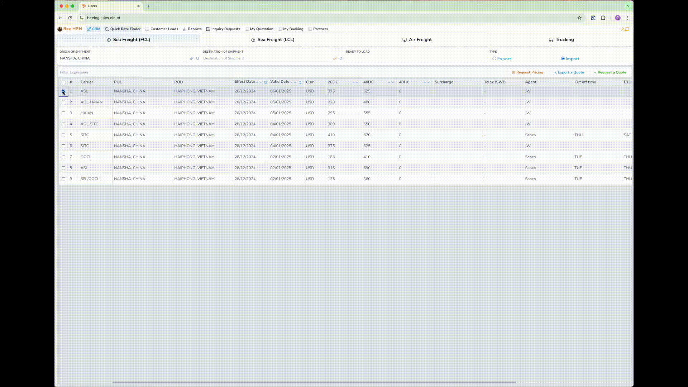
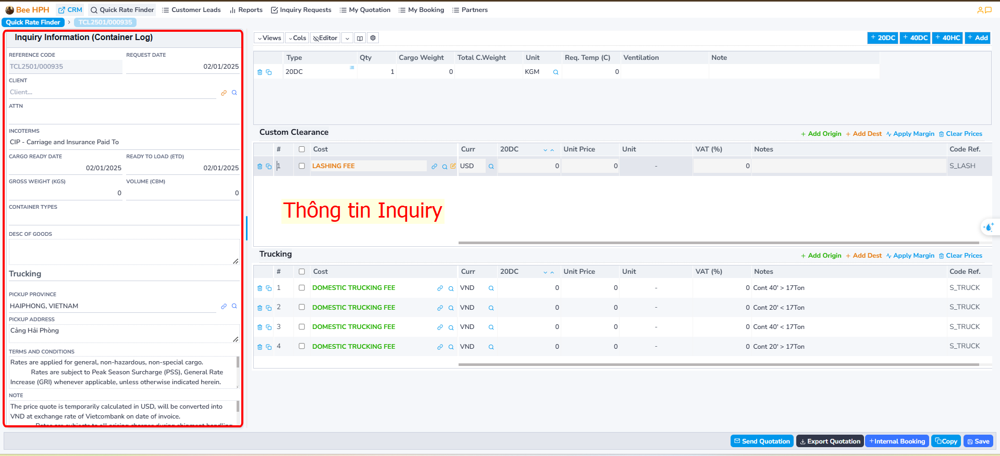
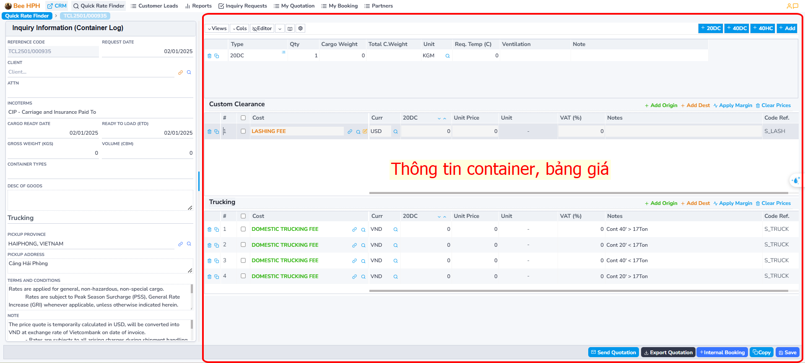
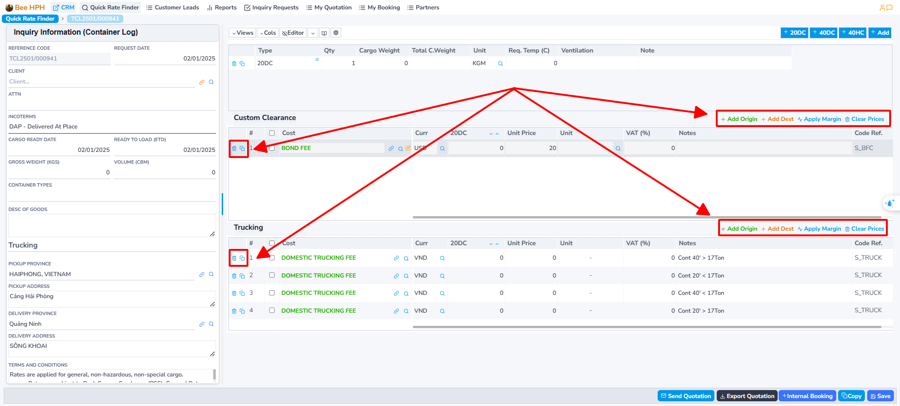
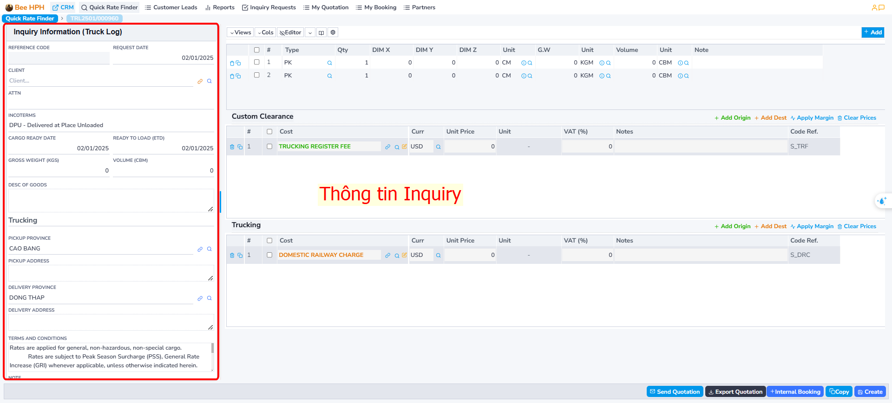
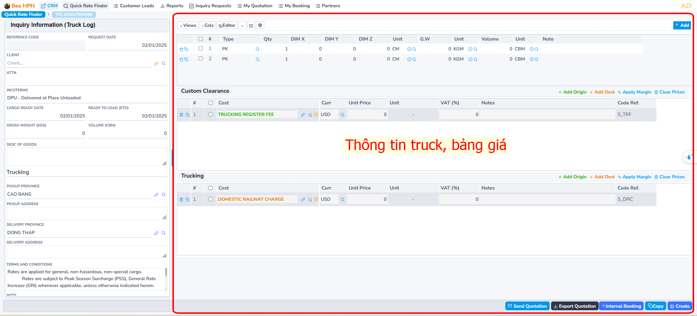
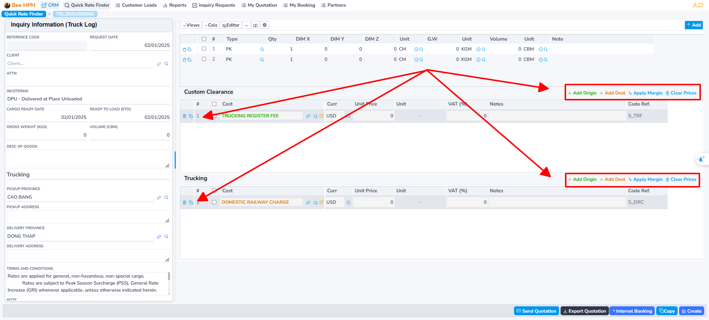

# Logistics

## Container

### 1. Price Search

To search for available prices from the Pricing Tools system (Logistics Prices), follow these steps:

Perform the price search and check as previously instructed.

### 2. Create a Quote

#### Case 1: Price Available in the System
After checking and finding a suitable price, click on that price
(you can select multiple prices from different carriers - ensuring the same route).

Then click the `Request a Quote` button to proceed with creating a quote.

For example, the action of selecting a price as shown. The software transitions to the quote screen.

#### Case 2: Price Not Available in the System

If the price is not available, you can create a custom quote by clicking the `Request a Quote` button.

Additionally, you can send a request to check the price to the pricing team by clicking the `Request Pricing` button.

The quote screen includes:

- Inquiry information screen (on the right).

- Container information screen/quote information table (on the left).

##### Customs/Trucking

Note, the Trucking price information entry screen may not display, depending on the incoterm (Inquiry information tab).

- **Add Origin**: Add Trucking/Customs at Origin.

- **Add Dest**: Add Trucking/Customs at Destination.

- **Clear Prices**: Clear all on the table.

##### Edit and Save Quote

- After editing the price table, press **Save** to save the quote.

##### Other Functions

- ***Export Quotation***: Export quotation information.
- ***Mail***: Send quotation email to the customer.
- ***Copy***: Create a copy of the quotation.
- ***Internal Booking***: Create a booking in the system.

### 3. Create IB, Push Information to BFSOne System

On the Quotation screen, after updating the information, the customer confirms the price.

Proceed to create IB, request the customer to open the file, as follows:
Select the Freight price on the list screen, then click Internal Booking on the toolbar,

The software transitions to the IB information screen:

Fill in the necessary information, then click **Create** to proceed. Note that the required information includes: Customer, Agent, Shipping Line/Coloader, Shipper, Consignee, ...

After creation, the software displays the IBooking (BFSOne) button,
click to send information to customer service to open the file.

## Truck

### 1. Price Search

To search for available prices from the Pricing Tools system (Logistics Prices), follow these steps:

Perform the price search and check as previously instructed.

### 2. Create a Quote

#### Case 1: Price Available in the System
After checking and finding a suitable price, click on that price
(you can select multiple prices from different carriers - ensuring the same route).

Then click the `Request a Quote` button to proceed with creating a quote.

For example, the action of selecting a price as shown. The software transitions to the quote screen.

#### Case 2: Price Not Available in the System

If the price is not available, you can create a custom quote by clicking the `Request a Quote` button.

Additionally, you can send a request to check the price to the pricing team by clicking the `Request Pricing` button.

The quote screen includes:

- Inquiry information screen (on the right).

- Container information screen/quote information table (on the left).

##### Customs/Trucking

Note, the Trucking price information entry screen may not display, depending on the incoterm (Inquiry information tab).

- **Add Origin**: Add Trucking/Customs at Origin.

- **Add Dest**: Add Trucking/Customs at Destination.

- **Clear Prices**: Clear all on the table.

##### Edit and Save Quote

- After editing the price table, press **Save** to save the quote.

##### Other Functions

- ***Export Quotation***: Export quotation information.
- ***Mail***: Send quotation email to the customer.
- ***Copy***: Create a copy of the quotation.
- ***Internal Booking***: Create a booking in the system.

### 3. Create IB, Push Information to BFSOne System

On the Quotation screen, after updating the information, the customer confirms the price.

Proceed to create IB, request the customer to open the file, as follows:
Select the Freight price on the list screen, then click Internal Booking on the toolbar,

The software transitions to the IB information screen:

Fill in the necessary information, then click **Create** to proceed. Note that the required information includes: Customer, Agent, Shipping Line/Coloader, Shipper, Consignee, ...

After creation, the software displays the IBooking (BFSOne) button,
click to send information to customer service to open the file.

