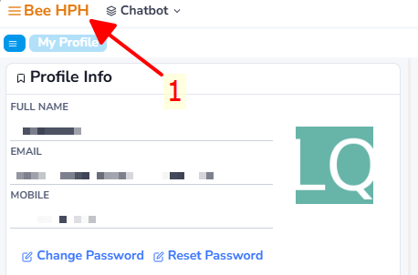
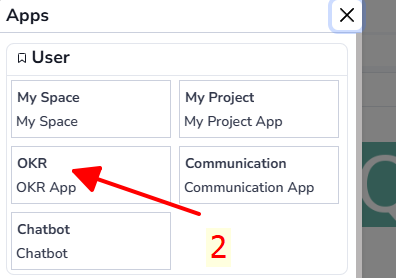
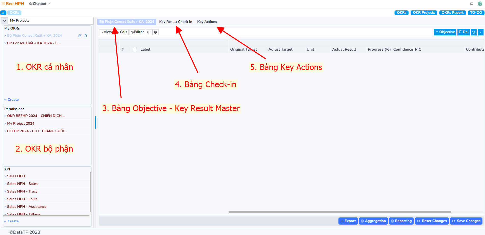
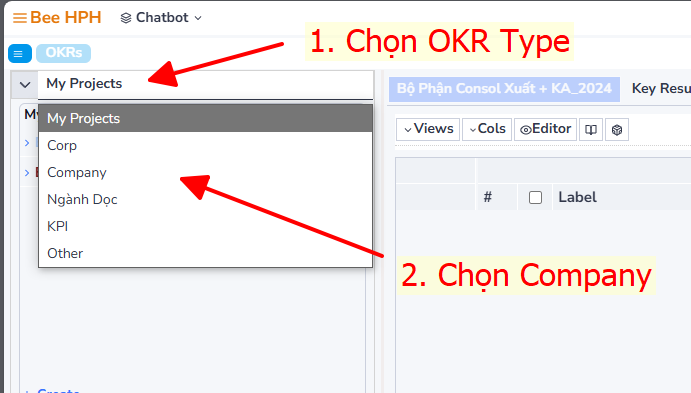
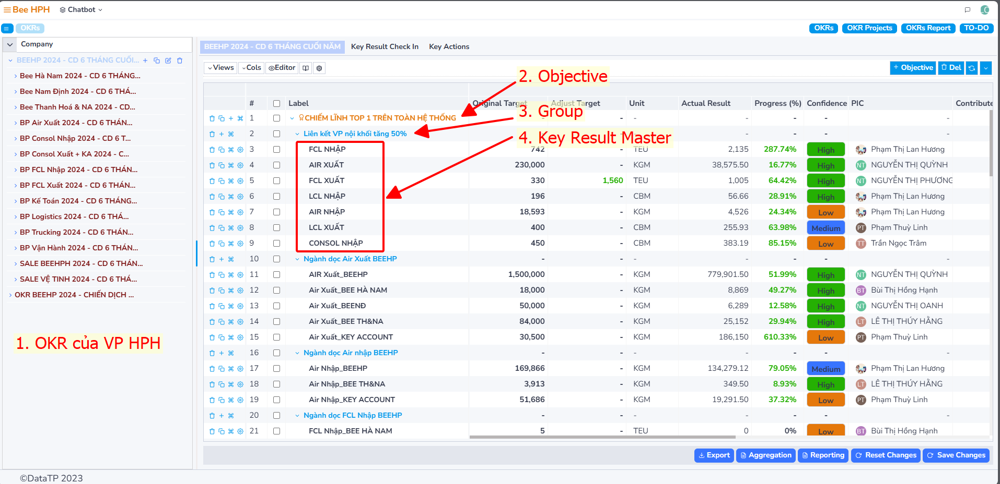
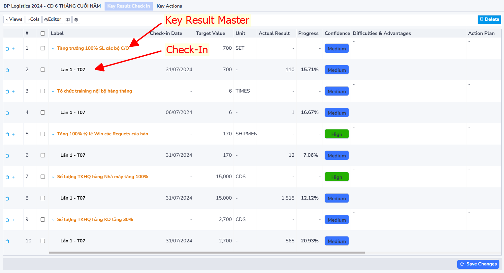
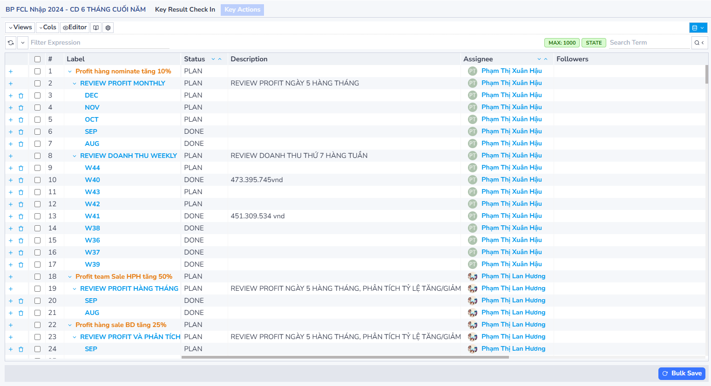
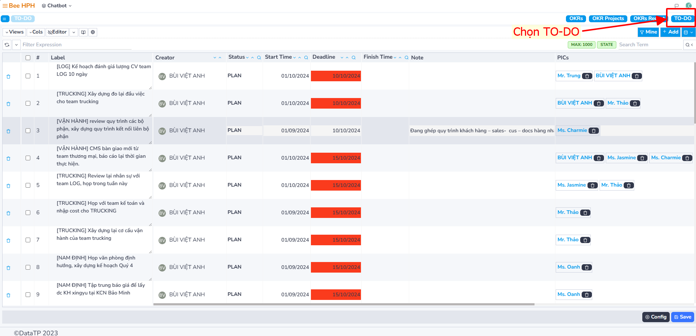

# OKR - Cấp quản lý.

## I. Truy cập OKR

1. Chọn **Menu**
2. Chọn App **OKR**

## II. Giao diện OKR

### 1. OKR Cá nhân
Các OKR Project thuộc quản lý của bản thân

### 2. OKR Bộ phận
Các OKR Project bản thân được phân quyền truy cập

### 3. Bảng Objective - Key Result Master
Hiển thị các Objective, Key Result Master, Mục tiêu, Kết quả, tiến độ công việc theo chiến dịch

### 4. Bảng Check-in
Hiển thị kết quả của Key Result Master vào thời điểm Check-in để theo dõi tiến độ công việc

### 5. Bảng Key Actions
Các Hành động cần làm để đạt được các target bộ phận đã đề ra

## III. OKR Bee HPH

Truy cập màn hình **OKR Bee HPH**

### Giao diện OKR Bee HPH

1. **OKR của VP HPH**: Tất cả các OKR của các bộ phận trong văn phòng HPH được thể hiện theo hình tree
2. **Objective**: Là các mục tiêu chính, thể hiện bằng các dòng màu cam
3. **Group**: Nhóm các kết quả then chốt, thể hiện bằng các dòng màu xanh
4. **Key Result Master**: Là các kết quả then chốt, thể hiện bằng dòng màu đen

### Thông tin các cột:

- **Label**: Nội dung chính
- **Original Target**: Mục tiêu ban đầu
- **Adjust Target**: Mục tiêu điều chỉnh
- **Unit**: Đơn vị tính
- **Actual Result**: Kết quả thực tế
- **Progress**: Phần trăm kết quả thực tế so với mục tiêu
- **Confidence**: Mức độ tự tin đạt được mục tiêu đề ra
- **PIC**: Người phụ trách chính cho kết quả then chốt
- **Contribute Result**: Kết quả kết hợp từ OKR Chéo
- **Related Section**: Người phụ trách OKR Chéo

## IV. Check-in

Bảng tổng hợp Check-in của toàn bộ Key Result Master

### Thông tin các cột:

- **Label**: Nội dung check-in
- **Check-in date**: Ngày Check-in
- **Target Value**: Mục tiêu
- **Unit**: Đơn vị tính
- **Actual Result**: Kết quả thực tế tại thời điểm check-in
- **Progress**: Phần trăm kết quả thực tế so với mục tiêu đề ra
- **Confidence**: Mức độ tự tin đạt được mục tiêu
- **Difficulties & Advantages**: Khó khăn - Lợi thế khi thực hiện kết quả then chốt
- **Action Plan**: Các việc cần làm để đạt được mục tiêu đề ra

## V. Key Actions

Là các hành động để đạt được các Mục tiêu, kết quả then chốt trong nội bộ các bộ phận.

### Thông tin các cột:

- **Label**: Nội dung check-in
- **Status**: Trạng thái
- **Description**: Mô tả
- **Assignee**: Người phụ trách
- **Follower**: Những người liên quan

## VI. TO-DO

Giao diện giao việc cho cấp Trưởng Bộ phận, quản lý.

### Thông tin các cột:

- **Label**: Nội dung check-in
- **Status**: Trạng thái
- **Creator**: Người giao việc
- **PICs**: Người phụ trách

**Video giới thiệu phần mềm: [Giới Thiệu Phần Mềm OKRs | BEE LOGISTICS](https://www.youtube.com/watch?v=G4tpEuOdNfI&t=727s)**

  

    <iframe
          style={{ position: 'absolute', top: 0, left: 0, width: '100%', height: '100%' }}
          src="https://www.youtube.com/embed/G4tpEuOdNfI?si=SSH9tsJbaKGkKqaA"
          frameBorder="0"
          allow="accelerometer; autoplay; clipboard-write; encrypted-media; gyroscope; picture-in-picture"
          allowFullScreen />
  
