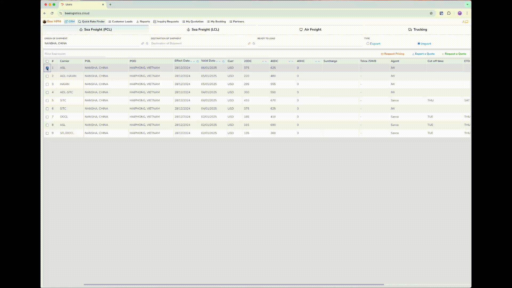
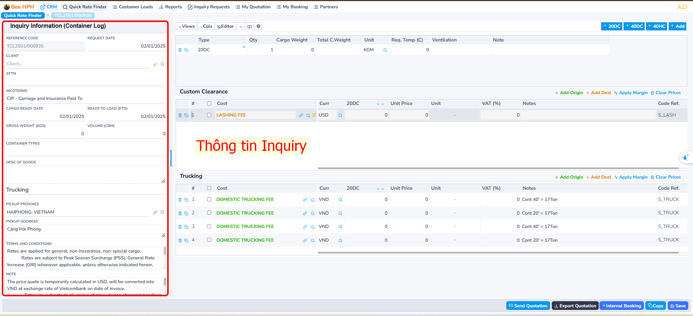
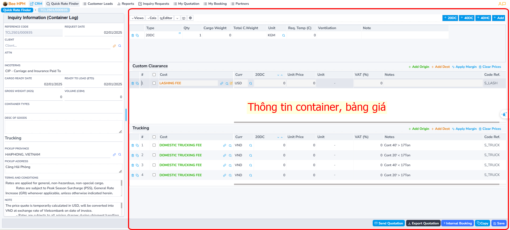
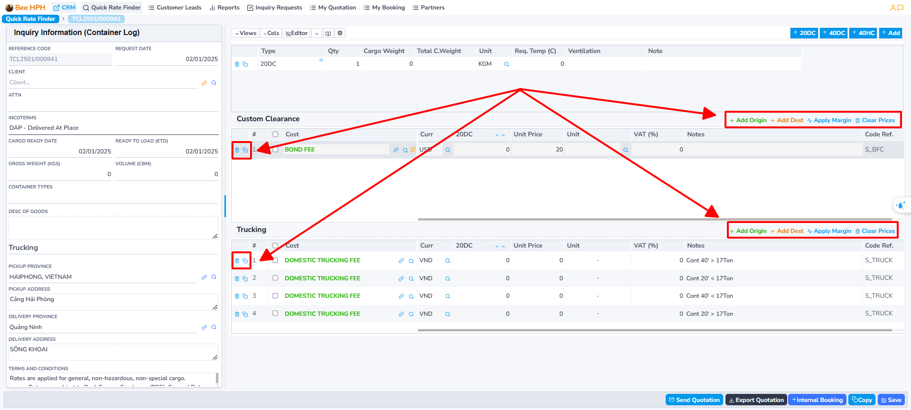
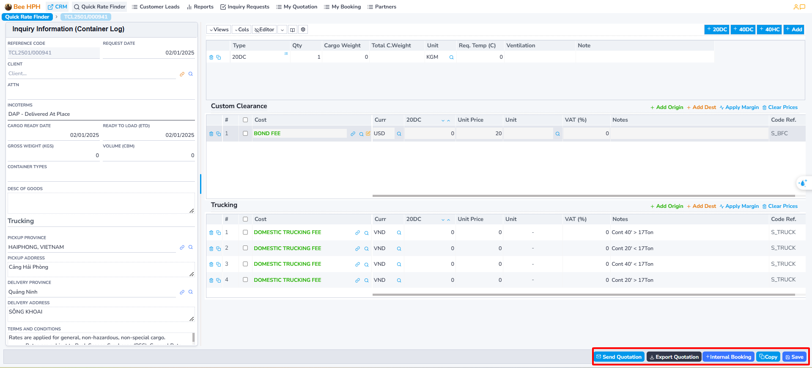
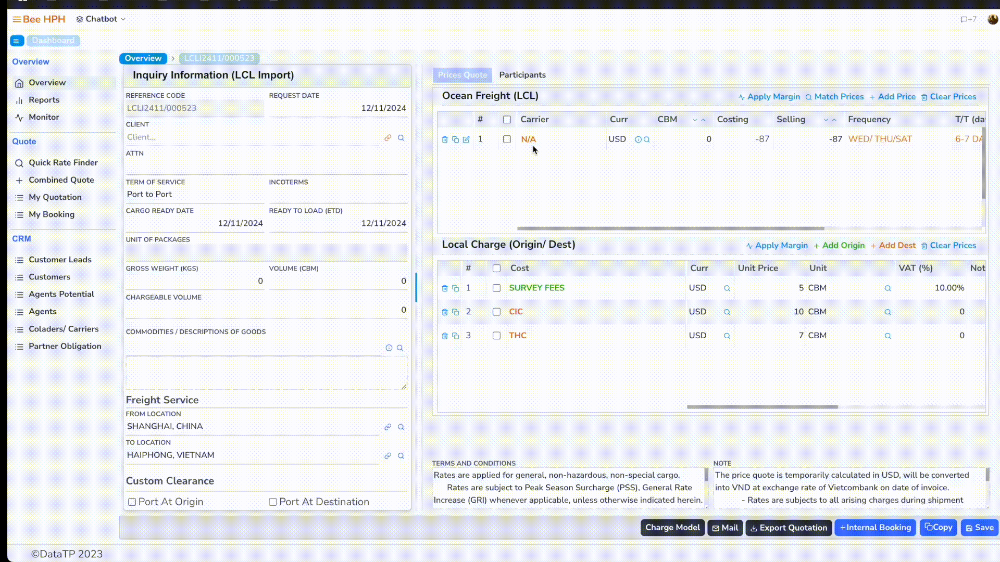
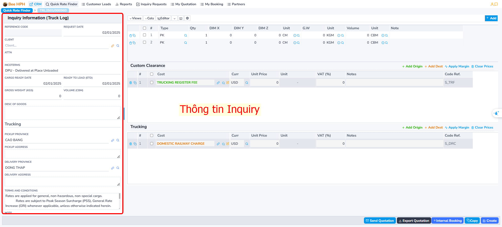
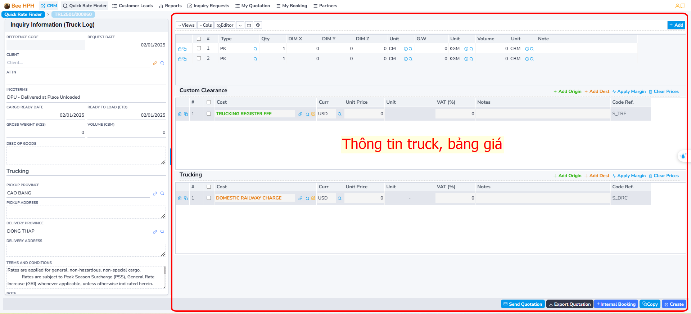
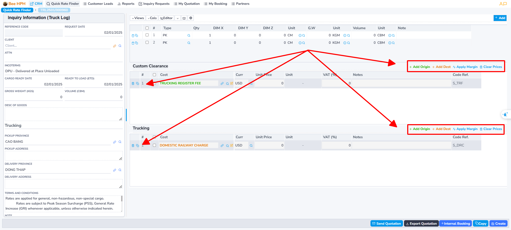
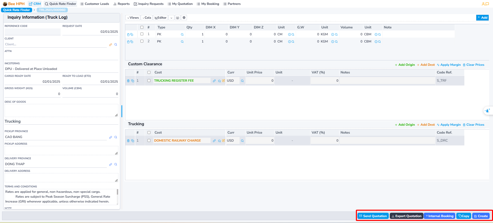

# Logistics

## Container

### 1. Tìm kiếm giá

Để tìm kiếm giá có sẵn từ hệ thống Pricing Tools (Logistics Prices), thực hiện các bước sau:

Thao tác tìm kiếm giá, check giá như đã hướng dẫn trước đó.

### 2. Tạo báo giá.

#### Trường hợp 1: Có giá trong hệ thống
Sau khi check và tìm thấy giá phù hợp, anh chị click chọn vào giá đó
(có thể chọn nhiều giá từ các carrier khác nhau - đảm bảo chung tuyến).

Click tiếp nút `Request a Quote` để tiến hành tạo báo giá.

Ví dụ, thao tác chọn giá như hình. Phần mềm chuyển qua màn hình báo giá.

#### Trường hợp 2: Không có giá trong hệ thống

Nếu giá không có sẵn, anh chị có thể tự tạo báo giá custom bằng cách click vào nút `Request a Quote`.

Ngoài ra, anh chị cũng có thể gửi request y/c check giá đến pricing team bằng cách click vào nút `Request Pricing`.

Màn hình báo giá gồm:

- Màn hình thông tin Inquiry (bên phải).

- Màn hình thông tin container/ bảng thông tin báo giá. (bên trái)

##### Khai quan/ Trucking

Lưu ý, màn hình nhập thông tin giá Trucking có thể không hiển thị, điều này phụ thuộc vào incoterm (Tab thông tin Inquiry).

- **Add Origin**: Thêm Trucking/ Khai quan at Origin.

- **Add Dest**: Thêm Trucking/ Khai quan at Destination.

- **Clear Prices**: Xóa tất cả trên bảng.

##### Chỉnh sửa và lưu báo giá

- Sau khi chỉnh sửa xong bảng giá, nhấn **Save** để lưu báo giá.

##### Các chức năng khác

- ***Export Quotation***: Xuất thông tin báo giá.
- ***Mail***: Gửi mail cho khách hàng báo giá.
- ***Copy***: Tạo bản sao quotation.
- ***Internal Booking***: Tạo Booking trong hệ thống

### 3. Tạo IB, đẩy thông tin qua hệ thống BFSOne.

Ở màn hình Quotation, sau khi cập nhật thông tin, khách hàng confirm giá.

Anh chị tiến hành tạo IB, request cus mở File, thao tác như sau:
Tích chọn giá Freight ở màn hình danh sách, sau đó click chọn Internal Booking trên thanh công cụ,

Phần mềm chuyển qua màn hình thông tin IB:

Điền các thông tin cần thiết, sau đó nhấp **Create** để tiến hành tạo. Lưu ý rằng các thông tin bắt buộc bao gồm: Khách hàng, Đại lý, Hãng tàu/Colader, Người gửi, Người nhận, ...

Sau khi tạo, phần mềm hiển thị nút IBooking (BFSOne),
anh chị click để gửi thông tin cho customer service mở file.

## Truck

### 1. Tìm kiếm giá

Để tìm kiếm giá có sẵn từ hệ thống Pricing Tools (Logistics Prices), thực hiện các bước sau:

Thao tác tìm kiếm giá, check giá như đã hướng dẫn trước đó.

### 2. Tạo báo giá.

#### Trường hợp 1: Có giá trong hệ thống
Sau khi check và tìm thấy giá phù hợp, anh chị click chọn vào giá đó
(có thể chọn nhiều giá từ các carrier khác nhau - đảm bảo chung tuyến).

Click tiếp nút `Request a Quote` để tiến hành tạo báo giá.

Ví dụ, thao tác chọn giá như hình. Phần mềm chuyển qua màn hình báo giá.

#### Trường hợp 2: Không có giá trong hệ thống

Nếu giá không có sẵn, anh chị có thể tự tạo báo giá custom bằng cách click vào nút `Request a Quote`.

Ngoài ra, anh chị cũng có thể gửi request y/c check giá đến pricing team bằng cách click vào nút `Request Pricing`.

Màn hình báo giá gồm:

- Màn hình thông tin Inquiry (bên phải).

- Màn hình thông tin container/ bảng thông tin báo giá. (bên trái)

##### Khai quan/ Trucking

Lưu ý, màn hình nhập thông tin giá Trucking có thể không hiển thị, điều này phụ thuộc vào incoterm (Tab thông tin Inquiry).

- **Add Origin**: Thêm Trucking/ Khai quan at Origin.

- **Add Dest**: Thêm Trucking/ Khai quan at Destination.

- **Clear Prices**: Xóa tất cả trên bảng.

##### Chỉnh sửa và lưu báo giá

- Sau khi chỉnh sửa xong bảng giá, nhấn **Save** để lưu báo giá.

##### Các chức năng khác

- ***Export Quotation***: Xuất thông tin báo giá.
- ***Mail***: Gửi mail cho khách hàng báo giá.
- ***Copy***: Tạo bản sao quotation.
- ***Internal Booking***: Tạo Booking trong hệ thống

### 3. Tạo IB, đẩy thông tin qua hệ thống BFSOne.

Ở màn hình Quotation, sau khi cập nhật thông tin, khách hàng confirm giá.

Anh chị tiến hành tạo IB, request cus mở File, thao tác như sau:
Tích chọn giá Freight ở màn hình danh sách, sau đó click chọn Internal Booking trên thanh công cụ,

Phần mềm chuyển qua màn hình thông tin IB:

Điền các thông tin cần thiết, sau đó nhấp **Create** để tiến hành tạo. Lưu ý rằng các thông tin bắt buộc bao gồm: Khách hàng, Đại lý, Hãng tàu/Colader, Người gửi, Người nhận, ...

Sau khi tạo, phần mềm hiển thị nút IBooking (BFSOne),
anh chị click để gửi thông tin cho customer service mở file.

