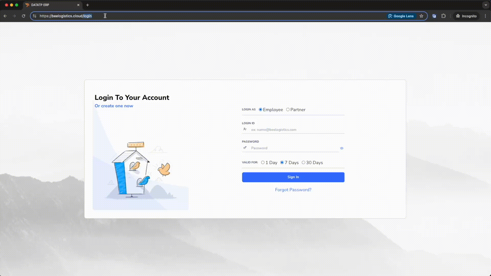
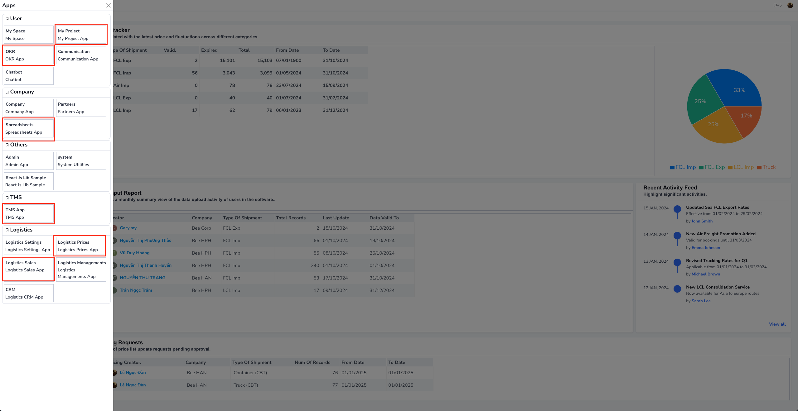

# 系统

欢迎使用 Bee Logistics 系统指南。在本指南中，我们将帮助您快速高效地开始使用该系统。

## 访问系统

要开始使用 Bee Logistics，请按照以下步骤操作：

1. 打开您的网页浏览器（Google Chrome、Firefox、Safari 等）。
2. 在地址栏中输入 https://beelogistics.cloud。
3. 按 Enter 键访问 Bee Logistics 的官方网站。

## 登录系统

访问网站后，您需要登录以使用系统的功能：

1. 在主页上输入您的登录信息：
   - 用户名 (`Username`): [提供的用户名]
   - 密码 (`Password`): [您的密码]
2. 点击“登录”按钮进入系统。

### 注意：
- 如果您忘记密码，请使用登录页面上的“忘记密码”功能。
- 确保保密您的登录信息，不与他人分享。

## 开始使用

成功登录后，您将被转到 Bee Logistics 系统的主页。从这里，您可以：

### 自定义个人信息和账户设置

成功登录后，您可以自定义个人信息和账户设置，以优化系统使用体验：

1. 更新个人信息: (待定)
   - 显示名称
   - 主电子邮件地址
   - 联系信息（电话号码、地址）
   - 头像

2. 设置与应用程序的连接：
   - Email/Outlook: 直接从系统接收通知和发送电子邮件
   - Zalo: 集成消息和通过 Zalo 通知
   - Teams: 与 Microsoft Teams 同步日历和通知

观看下面的详细视频教程：

3. 通知设置: (待定)
   - 自定义您想接收的通知类型
   - 选择接收通知的方式（电子邮件、Zalo 或两者）
   - 调整接收通知的频率

### 功能模块列表

开始使用工具和功能来管理您的物流工作。

以下是具有专门业务的应用程序列表，包括：

1. My Project, Spreadsheet 是与任务积累、文件跟踪相关的部分，替代旧的 Excel 文件方式

2. OKR - 目标和结果跟踪

3. TMS - 与运输单管理、车队相关的软件

4. Logistics Prices - 定价工具: 管理来自航线/航空公司/分包商的价格

5. Logistics Sales: 管理询价、报价、IB。

如需更多支持，请参考文档部分的详细指南或联系我们的支持团队。